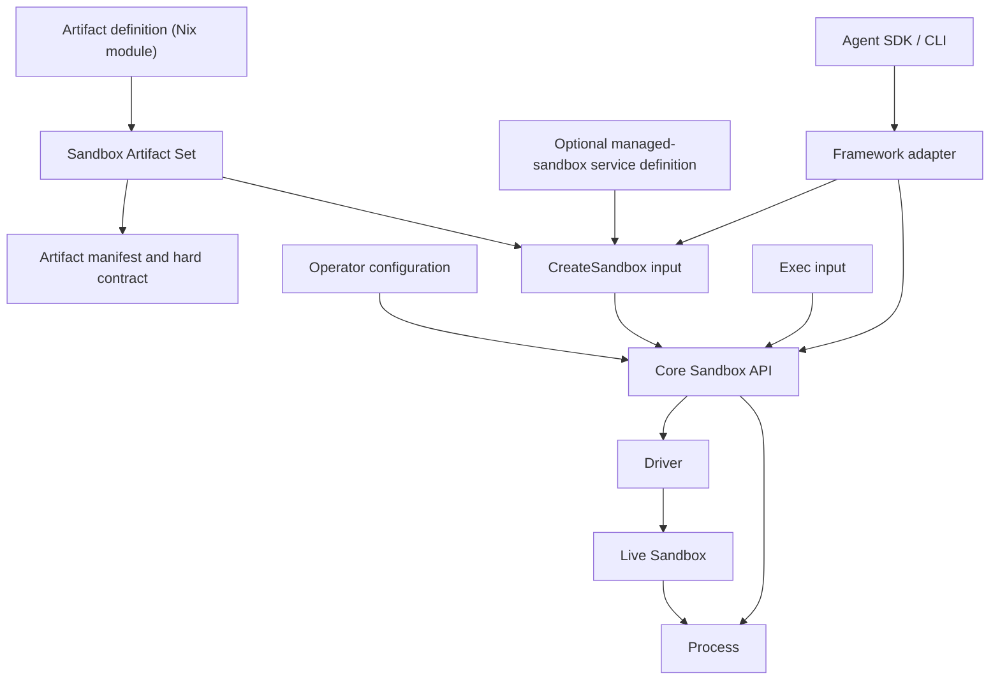
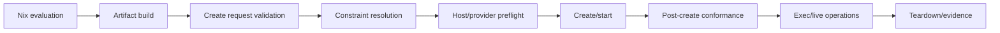

# Configuration Boundary Audit

Status: **Research synthesis — not locked**

Date: 2026-07-23

This audit determines where every class of sandbox configuration belongs before
the public Nix modules or runtime API are designed. It supersedes any earlier
research statement that treated all target-native configuration as artifact
configuration.

The audit is deliberately greenfield. Existing repository types and names do
not constrain the result.

## Executive answer

`CreateSandbox` inputs are part of the runtime API. They are not options in the
Nix module that defines an immutable Sandbox Artifact.

That does **not** mean runtime configuration must be imperative. Nix can also
declaratively manage live sandboxes, but it must do so through a separate
NixOS/service module that references a Sandbox Artifact and ultimately calls
the same runtime API. Artifact construction and desired runtime state are two
different declarative resources.

The recommended architecture is therefore:

1. A Nix **artifact definition** builds an immutable, content-addressed
   Sandbox Artifact Set.
2. A runtime **CreateSandbox input** supplies values for one live Sandbox.
3. An optional, separate NixOS **managed-sandbox service definition** may
   declaratively produce those runtime inputs and lifecycle behavior.
4. Framework adapters translate framework-specific run/session behavior into
   the same runtime API.
5. Drivers translate the runtime API into target/provider mechanisms.

The exact public name for the optional managed-service surface is not selected
by this report.

## The critical distinction

“Declarative” is a style of expressing desired state. It does not identify the
lifecycle or identity of the thing being declared.

These are all potentially declarative, but they are not the same object:

| Declarative object | Identity | Typical lifetime | May contain host bindings? | May contain secret references? |
|---|---|---|---|---|
| Artifact definition | Content/build identity | Immutable | Only content-addressed build inputs | No |
| Artifact manifest | Artifact identity and enforceable contract | Immutable | Logical slots and requirements only | Named secret slots only |
| Managed-sandbox service definition | Host system-generation identity | Until host reconfiguration | Yes | References or credential paths, never values in the Nix store |
| CreateSandbox input | One requested live Sandbox | One API operation | Yes | Opaque references or secure values |
| Live Sandbox state | Runtime-generated identity | Until termination/deletion | Resolved | Resolved but not normally readable |
| Exec input | One Process | One execution | No new isolation-boundary widening | Only explicitly permitted per-process bindings |

Putting all declarative values into the artifact would make the artifact
host-bound, provider-bound, secret-bearing, and unsuitable for reuse. Putting
all runtime values outside Nix would unnecessarily prevent declarative NixOS
service management. The boundary is resource identity, not syntax.

## Normative ownership test

Every future option must be assigned using these questions, in order:

1. **Does changing it change the immutable software/filesystem, build
   provenance, target implementation, or the hard contract every realization
   must obey?**
   It belongs to the artifact definition and manifest.
2. **Does it name a concrete host path, provider object, credential source,
   device, network attachment, placement, or allocation for one Sandbox?**
   It belongs to `CreateSandbox`.
3. **Does it describe ongoing desired host behavior such as autostart,
   restart, reconciliation, or garbage collection?**
   It belongs to an operator or managed-service configuration.
4. **Does it affect one command rather than the isolation boundary?**
   It belongs to `Exec`.
5. **Does it act on an already-created Sandbox?**
   It is a live operation.
6. **Does it exist because of OpenAI, another agent framework, or a particular
   agent harness?**
   It belongs to that framework adapter.
7. **Is it a mechanism needed to implement an already-owned semantic?**
   It belongs to the driver and is not a common public option.
8. **Is it only meaningful to one target/provider and intentionally exposed?**
   It belongs to an explicitly scoped native extension at the appropriate
   lifecycle layer, not a single undifferentiated `native` tree.

Being serializable, deterministic, or writable in Nix does not change these
answers.

## Resource model



The Artifact Set may contain several target artifacts built from one common
definition. For example:

- bubblewrap wrapper/runtime closure plus manifest;
- microVM guest system, boot assets, compatible runner components, and
  manifest;
- OCI image plus manifest.

The live Sandbox is never itself a Nix derivation. A snapshot may later become
an input to a new Sandbox, but it records runtime state and is not equivalent
to the original reproducible artifact.

## Composition-path boundary ledger

Packet D treats every route that can add, transform, transport, or attempt to
bypass configuration as a closed review coordinate. The normative registry is
[`PACKET-D-COMPOSITION-PATHS.json`](./research/invariants/PACKET-D-COMPOSITION-PATHS.json);
the complete invariant cross-product is
[`PACKET-D-COMPOSITION-COVERAGE.json`](./research/invariants/PACKET-D-COMPOSITION-COVERAGE.json).
The current candidate is exactly 54 paths × 140 invariants = 7,560 unique
cells. The machine records, rather than this prose, own those dimensions.

The boundaries are deliberately split:

| Route family | First owner/boundary | Authority |
|---|---|---|
| Artifact source, imports, profiles, explicit refinement | Artifact, `P1 -> A0/A1/W0` | May contribute, narrow, or select only as declared |
| Operator Configuration source/composition | Operator, `P1 -> OC0/O0` | May contribute, narrow, or select only within the closed Operator schema |
| Managed-Service Definition source/composition | Service, `P1 -> MS0/S0` | May contribute, narrow, or select only within the closed Definition schema |
| Language-native escape and opaque extension | Frontend then A1/W0 | No product authority |
| Renderer output | W0 input | Entire value is untrusted |
| Renderer-to-wire adaptation | W0 adapter | Total, versioned, lossless, fail-closed |
| Raw or migrated wire | W0 decoder/migrator | Bounded decode, old validation, deterministic migration, current validation |
| Typed Nix handle | A1/W0 identity then N0 resolution | Reference only; cannot carry arbitrary evaluator values |
| Direct Nix side-table value | N0, paired with portable identity | Value and complete identity must agree |
| Artifact-native guest/target extension | A1 scope then N0/N1 construction | Guest/build effects only; complete Packet C effect projection |
| Create-native extension | C0/D0 | One creation only; cannot alter Artifact identity or policy |
| Operator-native extension | O0/H0 | Registration, placement, infrastructure, and credentials only |
| Service/framework/CLI native extension | S0/F0 | Translation only, through the typed Core API |
| Live/Exec native extension | L0/E0 | One bounded operation; cannot change the isolation contract |
| Provider construction/build cache/result | Artifact-owned N0/N1 | Versioned construction protocol and independently verified result |
| Provider transfer | Operator/runtime H0 | Content/descriptor verification and placement only |
| Provider cache hit | Runtime D0 | Reverification before the separate manifest-load handoff |
| Provider live/Exec operation | Runtime L0/E0 | One bounded operation only |
| Built manifest/provider build result | N1/C0 input | Untrusted output; identity and evidence revalidated |
| Resolved driver handoff | `C0 -> O0 -> H0 -> D0` | Private typed stages only; may narrow but never widen |
| Serialized resolved reentry | `RW0 -> C0 -> O0 -> H0 -> D0` | Entire value untrusted; exact 89 built-load and 30 resolved-stage sets replayed before fresh private construction |
| Generated runtime configuration | D0 output | Product-generated total configuration; every undeclared backend default suppressed |
| Direct driver invocation | D0 driver-entry validator | No admitted value |
| Raw runtime configuration input | D0 driver-entry validator | No admitted value |

No path may construct the next private validated stage directly. Only the
authoritative boundary can produce `ValidatedArtifact`, `BuiltMember`,
`VerifiedManifest`, `ResolvedCreation`, or `PreparedLaunch`.

For serialized authoring frontends, W0 performs strict decoding and then calls
the same complete Artifact semantic rule set conceptually located at A1. This
is not two semantic authorities: A1 names when the rule becomes sound, while
W0 is the defensive serialized-input boundary.

Every registered extension used by a conforming result has a closed versioned
contract and a product-derived projection into the common Artifact fields,
Packet C profiles/cases, lifecycle owner, and identity domains. If the effect
cannot be projected, it is rejected or yields an explicitly non-conforming
type. A boolean expert/unsafe flag cannot preserve ordinary conformance
claims.

Target applicability is projected by rule, not guessed from a target-shaped
path name: `portable` maps to no runtime profile;
`all-packet-c-profiles` and `remote-provider` map to all four Packet C
profiles; an explicit profile list maps exactly to that list; and
`["oci-linux-v1","remote-provider"]` maps only to `oci-linux-v1`. Thus
`native-guest-module` projects only to the two microVM profiles, while
`oci-descriptor-transfer` projects only to OCI.

`prebuilt-member-transfer` and `oci-descriptor-transfer` end at H0;
`provider-cache-hit` ends at D0; and `provider-side-construction`,
`provider-build-cache`, and `corrupted-provider-build-result` end at N1.
Each then hands off to `built-artifact-load` as a separate C0 path. The
machine catalog records these as `separate-path-handoff` records, not
phase-edge assertions or authority to skip C0 manifest loading.

## Public layers

### 1. Artifact definition

The artifact definition owns immutable content, defaults intrinsic to that
content, and hard constraints that every valid live realization must satisfy.

It may configure:

- descriptive artifact metadata;
- target platform and architecture;
- packages, Nix closures, devShell import, and explicit activation;
- files generated or copied into immutable artifact content;
- root filesystem/image/guest construction;
- default non-secret environment;
- default command, arguments, working directory, and workload-visible user;
- required workspace destination and allowed access mode;
- protected or masked paths;
- logical mount, workspace, volume, device, port, and secret slots;
- private scratch paths and their required semantics;
- maximum network authority and required enforcement strength;
- workload identity and privilege bounds;
- Linux capability bounds, no-new-privileges, seccomp/LSM requirements;
- required device classes, never concrete host device identifiers;
- minimum resources and hard maximums;
- maximum permitted lifetime if lifetime is a security invariant;
- required runtime capabilities;
- guest/runtime protocol compatibility;
- build provenance;
- enabled artifact targets;
- target-native **artifact/build** configuration.

It must not contain:

- arbitrary current-host paths;
- current working directory;
- provider account, region, endpoint, or credentials;
- a concrete workspace checkout;
- concrete volume, snapshot, network, socket, or device IDs;
- secret values or provider secret references;
- actual CPU/RAM/device allocation for one live Sandbox unless the artifact is
  intentionally a fixed-size, target-specific appliance;
- create timeout, idle action, autostart, restart, reuse, pooling, or cleanup;
- a decision to snapshot after a run;
- result-export destinations;
- framework session state.

### 2. Artifact manifest

The manifest is immutable output, not a second authoring surface. It records:

- artifact ID, target type, system, architecture, and content digests;
- complete expansion of the selected named profile;
- software/default-process metadata;
- hard filesystem, network, identity, security, resource, and lifetime bounds;
- logical input/binding slots with types and destination constraints;
- secret slots without references or values;
- required and advertised capabilities;
- target implementation and protocol versions;
- build provenance and validation claims;
- target-native configuration that is safe to disclose;
- which claims are portable, target-specific, or not verified.

The runtime rejects a create request that cannot satisfy the manifest.

### 3. Operator configuration

Operator configuration belongs to the machine or service hosting drivers. It
may itself be a NixOS module.

It owns:

- daemon enablement, package/version, Unix socket or listener;
- local authentication and remote TLS;
- authorized callers and tenancy;
- enabled drivers and named driver instances;
- provider endpoints, accounts, credentials, and regions;
- state, cache, image, volume, snapshot, and log directories;
- Nix store/cache/registry access;
- KVM, user-namespace, cgroup, LSM, device, and group setup;
- network bridges, TAP pools, CNI, DNS, egress proxies, and ingress gateways;
- volume and snapshot backends;
- credential-provider integration;
- global quotas and hard ceilings;
- concurrency, admission, queues, pools, and placement policy;
- default cleanup and orphan reconciliation;
- logging, metrics, tracing, audit, and execution-record sinks;
- guest runtime compatibility policy;
- driver retry, backoff, health, and readiness policy.

An API caller may select a named allowed driver or placement class. It does not
receive the operator's provider credential.

### 4. Managed-sandbox service definition

This optional layer lets NixOS declaratively manage a Sandbox without changing
the Sandbox Artifact.

It may own:

- artifact reference;
- stable service/Sandbox name;
- driver selection;
- concrete workspace, volume, network, port, device, and secret bindings;
- actual resource allocation;
- create/start timeouts;
- autostart;
- restart/recreate behavior;
- graceful-stop behavior;
- desired retention and cleanup;
- health/readiness probes;
- dependencies on mounts, networks, credential services, and other units;
- log/evidence retention;
- systemd hardening around the runtime client;
- whether an artifact update recreates or restarts the Sandbox.

Its implementation should compile to systemd units or another reconciler that
calls the canonical runtime API. It must not invent a second set of sandbox
semantics.

This is analogous to:

- microvm.nix installing MicroVMs as systemd services separately from building
  runnable MicroVM packages;
- NixOS `virtualisation.oci-containers` referencing an image while separately
  declaring ports, volumes, environment, user, autostart, and service behavior.

### 5. `CreateSandbox` input

This is a typed request in the core runtime API. The CLI, generic SDK,
framework adapters, and optional managed-service controller all construct the
same logical input.

It owns values for one live Sandbox:

- artifact reference and selected target artifact;
- optional requested ID/name and non-security labels;
- named driver;
- concrete workspace source and binding strategy;
- concrete mount, volume, snapshot, and initial-data bindings;
- secret bindings for declared slots;
- actual CPU, memory, task, disk, I/O, and device allocation;
- concrete device requests or IDs where operator policy permits them;
- network attachment and an authority subset no broader than the artifact;
- DNS/proxy selection within policy;
- ingress/publication requests for declared ports;
- actual workload identity mapping where needed;
- target/provider placement hints;
- create/start timeout;
- maximum runtime/TTL requested for this instance;
- supported idle/end behavior;
- initial snapshot/restore source;
- output/evidence capture requested for this run;
- target/provider create extensions;
- idempotency key and caller correlation metadata.

It does not own:

- packages or immutable root filesystem content;
- a wider policy than the artifact;
- daemon credentials;
- adapter conversation state;
- arbitrary command defaults that mutate artifact identity.

The create operation computes a fully resolved configuration from:

```text
operator permissions and ceilings
∩ artifact manifest requirements and bounds
∩ CreateSandbox input
∩ live host/provider capabilities
```

Intersection means authority can only narrow. Resource minimums must still be
met. Any contradiction fails before the untrusted workload starts.

The fully resolved configuration is inspectable and recorded, but does not
need to be promoted to a separate foundational public resource.

### 6. Live Sandbox API

The live API owns state and operations after successful creation:

- get/list/watch status;
- inspect effective capabilities and binding metadata;
- start when creation and start are separate;
- stop/terminate/delete;
- signal the initial process or Sandbox;
- upload/download/list/stat/remove files;
- expose, resolve, or revoke ports where supported;
- stream logs and execution evidence;
- update only explicitly mutable policy subsets;
- pause/resume when advertised;
- snapshot/checkpoint when advertised;
- restore by creating another Sandbox;
- fork/clone when advertised;
- dynamic resize when advertised;
- renew a TTL within hard bounds;
- attach/reconnect;
- create a Shell;
- execute a Process.

No live operation may widen immutable artifact policy. A provider API that
allows such widening must be fenced by the driver.

### 7. `Exec` input

`Exec` owns one Process:

- exact argv array and optional argv zero;
- cwd;
- non-secret environment delta;
- allowed per-process secret bindings;
- stdin source;
- stdout/stderr streaming and capture;
- timeout/deadline;
- foreground/background/detached behavior;
- PTY request, terminal size, and resize;
- workload user/group when allowed;
- process-local rlimits or scheduling when allowed;
- signal/cancellation semantics;
- output collection associated with this process;
- correlation metadata.

Changing an Exec input does not produce a new Sandbox Artifact and must not
change the Sandbox isolation boundary.

### 8. Framework adapter

The adapter owns only framework semantics:

- agent-to-sandbox association;
- framework defaults and per-run overrides;
- live-session reuse versus fresh creation;
- conversation/run state versus sandbox state;
- framework Manifest/workspace translation;
- framework capability/tool registration;
- tool names, descriptions, instructions, and prompt shaping;
- model-facing output limits;
- approval/guardrail integration;
- snapshot/reconnect behavior selected by the framework caller;
- framework tracing and correlation;
- safe conversion of core diagnostics into framework results;
- cleanup responsibility when the framework owns the session.

OpenAI's documentation explicitly separates harness control-plane state from
sandbox compute state and permits SDK-owned or developer-owned sandbox
lifecycles. Those decisions do not belong in the Artifact Definition.

The framework adapter and CLI use one typed translation contract for
`CreateSandbox`, live-operation, and `Exec` inputs. Teardown state transitions,
cleanup, retry, and idempotency remain Packet E concerns; Packet D proves only
that translation cannot widen or bypass the typed Core API.

### 9. Driver implementation and native extensions

The driver owns mechanisms:

- translating logical slots into target mounts/shares/uploads;
- generating bubblewrap flags;
- generating an OCI runtime bundle;
- launching and supervising a microVM;
- selecting provider API calls;
- process transport and guest runtime details;
- host namespace/cgroup/device plumbing;
- capability discovery and preflight;
- cleanup and error normalization.

Native extensions must be split by lifecycle:

```text
artifact-native configuration
create-native configuration
operator-native configuration
live-operation-native input
exec-native input
adapter-native configuration
```

A single `targets.<target>.native` subtree is insufficient because the
underlying targets themselves mix these concerns.

## Complete cross-layer ownership matrix

| Concern | Artifact definition / manifest | Operator or managed service | CreateSandbox | Live / Exec / Adapter |
|---|---|---|---|---|
| Artifact name/description | Yes | No | Reference only | No |
| Live Sandbox name/labels | Optional naming constraints | May declare stable name | Actual requested name/labels | Returned identity |
| Packages/devShell | Yes | No | No | No |
| Immutable files/rootfs | Yes | No | Reference only | Files may mutate in writable layers |
| Default argv/cwd/env | Yes, non-secret defaults | May choose invocation policy separately | Initial process only if API creates one | Exec may override within policy |
| Actual command | No, except appliance entrypoint default | May declare service command | Optional initial process | Exec owns commands |
| Workspace destination | Yes | May bind source | Concrete source/binding | Files API observes results |
| Workspace source checkout | No | Yes | Yes | Adapter Manifest may supply it |
| Workspace access ceiling | Yes | Cannot widen | Chooses equal/narrower access | Immutable |
| Protected paths | Yes | Cannot weaken | Driver realizes them | Immutable |
| Static generated input | Yes | No | May select declared artifact | No |
| Runtime upload/materialization | Logical slot only | May name source | Actual source | Files API performs transfer |
| Mount destination/type | Contract/slot | May bind | Actual binding | Immutable unless capability says otherwise |
| Host mount source | Never, except content-addressed store input | Yes | Yes | Driver-resolved |
| Scratch/tmpfs semantics | Required locations and maximums | May request sizes | Actual sizes | Mutates, then discarded |
| Persistent volume slot | Slot and access bounds | Concrete volume | Concrete volume | Attach/reload only if supported |
| Snapshot requirement | Required capability only | May declare boot source/policy | Concrete source | Create/capture/delete operations |
| Result/output conventions | Optional intrinsic paths | Capture/export policy | Per-run selection | Collect after Process/Sandbox |
| Network maximum authority | Yes | Operator may narrow | Equal/narrower actual policy | Mutable only if declared safe |
| Network mechanism | No | Host networks/proxies | Named attachment | Driver |
| DNS | Requirements/bounds | Resolver classes | Actual resolver/proxy | Driver |
| Ingress/listening ports | Declare intended guest ports | Gateway policy | Publish request | Resolve/revoke |
| Concrete host/public ports | No | May reserve | Requested/allocated | Returned runtime state |
| Unix sockets/DBus/Wayland | Logical channel and policy | Host broker availability | Concrete binding | Driver |
| Vsock | Required channel class | CID pool/operator policy | Concrete CID/channel | Driver/guest runtime |
| Workload UID/GID/user | Visible identity and bounds | Mapping policy | Actual host mapping | Per-exec user may narrow |
| Outer launcher user | No | Yes | Named driver implicitly | Driver |
| User namespace mappings | Required isolation semantics | Host ranges | Actual mapping | Driver |
| Capabilities/no-new-privileges | Hard bounds | May narrow | Cannot widen | Per-exec may narrow |
| Seccomp/LSM | Required policy/profile content | Host profile availability | Concrete host label/profile binding | Driver |
| Devices | Required class and access | Allowed inventory | Concrete device | Hotplug only if supported |
| CPU | Minimum/maximum/fixed appliance | Global ceiling | Actual allocation | Resize if supported |
| Memory | Minimum/maximum/fixed appliance | Global ceiling | Actual allocation | Resize/balloon if supported |
| PIDs/tasks | Hard maximum or requirement | Global ceiling | Actual limit | Driver enforces |
| Disk/tmpfs/I/O | Requirements/hard bounds | Storage classes/ceilings | Actual allocations | Resize if supported |
| GPU | Required class/capability | Inventory/placement | Concrete request/device | Driver |
| Secret slot | Name, destination forms, audience | Provider integration | Reference/value binding | Value never returned |
| Secret value | Never | External store | Secure create/exec channel | Redacted |
| Driver/provider | Required capabilities only | Enabled named drivers | Select named driver | Adapter may choose |
| Provider endpoint/account | Never | Yes | Logical driver name only | Driver |
| Region/placement | Platform requirement at most | Allowed placements | Actual hint | Returned state |
| Create timeout | No | Managed-service policy | Yes | No |
| Process timeout | No | Managed-service default | No | Exec |
| TTL/max lifetime | Hard security maximum only | Service policy/default | Requested value | Renew within bounds |
| Idle detection/action | No | Controller policy | Requested supported behavior | Adapter/controller observes |
| Autostart/restart | No | Yes | No | Controller |
| Pause/resume | Required capability only | Policy may invoke | No | Live operation |
| Snapshot timing/retention | Required capability at most | Yes | Initial source only | Live/controller |
| Pool/reuse/concurrency | No | Operator/adapter | Correlation only | Adapter/controller |
| Health/readiness | Guest endpoint may be declared | Probe policy | Probe parameters | Status |
| Logs/stdio | Build logs separate | Sink/retention | Capture preference | Process/live streams |
| Build provenance | Yes | No | Artifact reference | Execution record links it |
| Execution evidence | Schema/required claims only | Sink/retention | Requested level | Generated at runtime |
| Conversation/run state | No | No | No | Framework adapter |
| Agent tools/guardrails | No | No | No | Framework adapter |

## Target audit: bubblewrap and jail.nix

### Fundamental runtime shape

Bubblewrap is a low-level **launch** utility. It constructs namespaces,
mounts, environment, and one initial process. The sandbox normally disappears
when its processes exit. It does not define a persistent create-then-exec API,
file API, snapshot API, or multi-process control protocol.

Therefore:

- one-shot `run` may map directly to one bubblewrap launch;
- a live Sandbox supporting later `Exec` requires a driver-owned namespace
  keeper, host `nsenter`-style mechanism, or guest runtime;
- lifecycle capabilities must reflect which implementation is selected;
- jail.nix by itself is a wrapper builder, not the complete core Sandbox API.

### Bubblewrap option classification

| Bubblewrap surface | Proposed owner |
|---|---|
| `--args FD` | Driver-internal safe argument transport |
| `--argv0` | Exec input or artifact default |
| `--level-prefix` | Driver logging |
| `--unshare-user/ipc/pid/net/uts/cgroup`, `--unshare-all`, `--share-net` | Lowered artifact isolation policy |
| `--userns`, `--userns2`, `--pidns` | Driver/operator namespace plumbing |
| `--disable-userns`, `--assert-userns-disabled` | Artifact security requirement, driver mechanism |
| `--uid`, `--gid` | Artifact-visible identity plus create-time host mapping |
| `--hostname` | Artifact default or create-time live identity |
| `--chdir` | Artifact default or Exec cwd |
| `--setenv`, `--unsetenv`, `--clearenv` | Artifact default environment plus Exec delta |
| `--lock-file`, `--sync-fd`, `--block-fd`, `--userns-block-fd` | Driver lifecycle/synchronization internals |
| `--bind`, `--ro-bind`, `--dev-bind`, `*-try` | Artifact destination/access contract plus create-time host source |
| `--remount-ro` | Driver enforcement of artifact policy |
| overlay source and `--overlay/--tmp-overlay/--ro-overlay` | Artifact layer semantics plus create-time writable/work paths |
| `--proc`, `--dev`, `--mqueue`, `--tmpfs`, `--dir`, `--symlink`, `--chmod` | Artifact filesystem contract lowered by driver |
| `--perms`, `--size` | Artifact hard bounds and create-time actual tmpfs sizing |
| `--file`, `--bind-data`, `--ro-bind-data` | Artifact-generated file or secure create-time materialization |
| `--seccomp`, `--add-seccomp-fd` | Artifact seccomp policy; FD is driver-internal |
| `--exec-label`, `--file-label` | Artifact LSM requirement plus operator/create host label binding |
| `--info-fd`, `--json-status-fd` | Driver observation/evidence |
| `--new-session` | Artifact security baseline, reconciled with Exec PTY requirements |
| `--die-with-parent` | Driver/controller lifecycle implementation |
| `--as-pid-1` | Driver process-supervision implementation |
| `--cap-add`, `--cap-drop` | Artifact hard capability policy |
| command after options | Exec or initial Process input |

`--help` and `--version` are tool administration, not product configuration.

### jail.nix classification

jail.nix exposes deterministic composition and runtime-dependent composition in
the same `Permission` type.

Artifact-safe or projectable concepts include:

- package closure and `PATH` composition;
- immutable package/file binds;
- fixed environment defaults;
- fixed hostname;
- fixed seccomp program;
- proc/dev/tmpfs layout;
- fake passwd/group;
- namespace and capability policy when semantically inspected;
- fixed wrapper entrypoint.

Runtime/host-bound concepts include:

- `mount-cwd`;
- `fwd-env` and `try-fwd-env`;
- `readonly-paths-from-var`;
- `readonly-runtime-args` and `readwrite-runtime-args`;
- arbitrary host paths in `readonly`, `readwrite`, `ro-bind`, or `rw-bind`;
- `persist-home`;
- camera, GPU, GUI, DBus, PipeWire, PulseAudio, Wayland, browser, and host
  channels;
- `add-runtime` and `add-cleanup`;
- runtime-produced seccomp programs;
- runtime overlay writable/work paths.

Opaque or unsafe concepts include:

- `unsafe-add-raw-args`;
- `noescape`;
- arbitrary `wrap-entry`;
- arbitrary `add-runtime`;
- `reset` when it can erase required baseline policy;
- unsafe DBus and X11 exposure.

The artifact module cannot accept every jail.nix combinator and still claim
that common policy was validated. The product must either:

1. expose a checked/projectable artifact-native subset and put host bindings in
   create-native input;
2. allow opaque native permissions only with explicit loss of affected
   conformance claims; or
3. reject opaque combinators.

This is a product decision still requiring approval.

## Target audit: microvm.nix

### Fundamental runtime shape

microvm.nix intentionally spans multiple resources:

- NixOS guest construction;
- boot/store artifacts;
- hypervisor runner construction;
- host-side shares, disks, interfaces, sockets, and devices;
- generated systemd services and imperative management.

Its upstream option hierarchy is therefore not a suitable public ownership
boundary for this product.

A reusable microVM Sandbox Artifact needs a guest runtime or another driver
transport for `Exec`, file transfer, ports, status, and graceful termination.
The hypervisor's control socket alone does not provide the complete core API.

### Complete microvm.nix option-family classification

| microvm.nix family | Product ownership |
|---|---|
| `guest.enable`, `optimize.enable` | Target-native artifact/guest build |
| guest NixOS modules and packages | Artifact definition |
| `kernel`, `initrdPath`, `kernelParams` | Target-native artifact/guest boot |
| `storeOnDisk`, `storeDiskType`, `storeDisk*Flags`, `registerClosure`, `systemSymlink` | Target-native artifact construction |
| `writableStoreOverlay` destination semantics | Artifact; concrete backing comes from create |
| `hypervisor`, `cpu`, `qemu.machine`, `qemu.machineOpts` | Target-native artifact/runtime compatibility contract |
| hypervisor and virtiofsd package selections | Target-native artifact/toolchain |
| static hypervisor extra arguments/config | Artifact-native only if projectable, deterministic, non-secret, and host-independent |
| `preStart`, `extraArgsScript` | Create-native or operator-native; arbitrary shell is not artifact-safe |
| `socket` | Concrete create/driver binding |
| outer `user` | Operator/driver launcher identity |
| `vcpu`, `mem` | Create allocation within artifact bounds; fixed appliance definitions may pin them |
| `hugepageMem` | Create allocation plus host capability |
| `hotplugMem`, `hotpluggedMem`, `balloon`, `initialBalloonMem`, `deflateOnOOM` | Create/live resource mechanism and capability |
| `forwardPorts.*` | Create ingress/egress publication; concrete host address/port is host-bound |
| `volumes.*.image` | Concrete create volume binding |
| volume serial/readOnly/size/fs/image type | Slot contract plus create allocation/mechanism |
| `interfaces.*` | Concrete create network attachment; IDs/bridges/links are host-bound |
| `shares.*.mountPoint/readOnly` | Artifact destination/access contract |
| `shares.*.source/socket/tag/proto/cache/securityModel/ACL/extraArgs` | Create-native/driver mechanism; source and socket are host-bound |
| `devices.*` | Concrete create device binding; QEMU bus details are create-native |
| `vsock.cid` | Create/driver-assigned live identity |
| `registerWithMachined` | Operator/managed-service behavior |
| `machineId` | Create-time live identity unless deliberately fixed for an appliance |
| `graphics.enable` guest requirement | Artifact capability |
| graphics backend/socket and host package | Create/operator/native mechanism |
| QEMU PCIe root-port topology | Target-native compatibility artifact when fixed; live hotplug uses live API |
| Firecracker CPU template/drive engine/config | Target-native artifact/create mechanism split by whether it is fixed and host-independent |
| crosvm pivot root | Operator/driver host binding |
| vfkit Rosetta availability/install/ignore | Operator preflight and target-native host policy |
| `prettyProcnames` | Driver/operator observability |
| virtiofsd inode handles/thread pool/group/extra args | Operator/create driver mechanism |
| `credentialFiles` | Secret create binding; never Artifact Definition |
| `cloud-hypervisor.platformOEMStrings` | Artifact metadata only if non-secret; credentials belong to secure create binding |
| `runner`, `declaredRunner`, `binScripts` | Derived artifact/driver implementation outputs, not authoring inputs |

### Consequence for lowering

Using `config.microvm.declaredRunner` unchanged tends to bake CPU, memory,
shares, ports, and other launch arguments into a runner script. That is valid
for a fixed appliance but conflicts with a reusable artifact whose allocation
and host bindings are supplied at create time.

The microVM target must choose one of these implementation strategies:

1. generate a parameterized runner from microvm.nix outputs;
2. build boot/guest assets and have our driver construct the hypervisor command;
3. build one artifact variant per complete fixed launch configuration.

Strategy 2 or a carefully supported Strategy 1 best preserves artifact reuse.
Strategy 3 is simplest but makes workspaces, resources, devices, and host
bindings part of artifact identity and is unsuitable as the only product
model.

## Target audit: OCI

### OCI already proves the boundary

OCI defines separate immutable image and runtime resources.

The OCI Image Configuration is content-addressed. Changing its JSON changes
the ImageID. It contains:

- creation metadata and author;
- architecture, OS, OS version/features, and variant;
- root filesystem layer DiffIDs and history;
- default `User`;
- default `ExposedPorts`;
- default `Env`;
- default `Entrypoint` and `Cmd`;
- declared `Volumes`;
- default `WorkingDir`;
- `Labels`;
- `StopSignal`;
- deprecated `ArgsEscaped`;
- reserved compatibility fields.

Most execution fields are explicitly defaults that may be replaced when a
container is created. An image does not contain enforceable runtime mounts,
namespace topology, cgroups, or concrete network attachments.

### OCI runtime bundle/create configuration

The driver generates a runtime bundle for one container. Relevant fields
include:

- `ociVersion`;
- root filesystem path and readonly flag;
- initial process argv, environment, cwd, terminal/console size;
- process UID/GID/groups/umask;
- capabilities, rlimits, no-new-privileges;
- AppArmor/SELinux labels;
- OOM score, scheduling, I/O priority, and CPU affinity;
- hostname/domain name;
- mounts with source, destination, type, options, and ID mappings;
- lifecycle hooks;
- annotations;
- Linux devices and device cgroup rules;
- network devices;
- UID/GID mappings;
- namespaces or paths to existing namespaces;
- cgroup path;
- CPU, memory, PIDs, block I/O, hugepage, network, RDMA, and unified cgroup
  controls;
- rootfs propagation;
- seccomp;
- sysctls;
- masked and readonly paths;
- mount label;
- Intel RDT, memory policy, personality, and time offsets.

These values are not all user-facing common options. Many are driver-native or
operator-native mechanisms.

### OCI lifecycle

OCI core standardizes:

- query state;
- create from bundle and unique ID;
- start the initial process;
- kill with a signal;
- delete a stopped container;
- lifecycle hooks.

OCI core does not standardize a secondary `exec`, file API, pause, snapshot,
checkpoint, restore, port publication, image pull, volume manager, CNI setup,
or provider control plane. Those come from an engine/runtime extension or our
driver.

The OCI target output should therefore be:

```text
OCI image
+ Sandbox Artifact manifest
```

At create time, the OCI driver combines the image, artifact manifest,
CreateSandbox input, and operator configuration into an OCI bundle and engine
operations. The artifact definition must not pretend that runtime `config.json`
is an immutable portable image property.

## Framework audit: OpenAI Agents

OpenAI's current Sandbox Agents model distinguishes:

- `SandboxAgent`: agent definition and sandbox defaults;
- `Manifest`: fresh-session workspace inputs;
- capabilities: agent-facing tools and behavior;
- sandbox client: provider integration;
- sandbox session: live compute state;
- sandbox run configuration: live session, client, provider options, or fresh
  inputs for one run;
- conversation/run state;
- serialized sandbox session state;
- snapshots that seed a new session.

It also supports two lifecycle ownership modes:

- SDK-owned: pass a client and let the runner close the session;
- developer-owned: pass a live session and reuse/close it explicitly.

Therefore the OpenAI adapter must be able to:

- resolve or accept a live core Sandbox;
- translate Manifest entries to workspace/create/file operations;
- choose fresh, resumed, or snapshot-seeded creation;
- hold core Sandbox IDs in serialized adapter state;
- expose shell/filesystem capabilities using core operations;
- preserve the framework's lifecycle ownership choice;
- keep conversation state separate from Sandbox state.

None of those framework choices change the Sandbox Artifact.

## Provider generalization checks

E2B and Modal validate the split:

- an E2B Template is reusable starting state, while timeout, auto-pause,
  auto-resume, network rules, environment, metadata, secure communication, and
  volume mounts are create inputs;
- E2B snapshots capture live filesystem/memory state and are explicitly
  contrasted with declarative templates;
- Modal selects image, command, secrets, volumes, network policy, resources,
  PTY, region/placement, proxy, identity token, readiness, and timeout when
  creating a Sandbox;
- both expose live process/file/lifecycle operations beyond artifact creation.

Provider vocabulary must remain inside each driver extension unless a semantic
is proven portable.

## Three architecture choices

### Model 1: Artifact-only Nix, runtime API only

Nix builds Sandbox Artifacts. Every live Sandbox is created by CLI/SDK/adapter
calls.

Advantages:

- smallest and purest artifact surface;
- easiest initial implementation;
- no duplicate service reconciliation semantics;
- portable artifacts remain clearly reusable.

Costs:

- NixOS users must hand-write systemd/runtime integration for long-lived
  sandboxes;
- no first-party declarative autostart/restart/bindings;
- users may incorrectly bake host values into native artifact configuration.

This is a reasonable v1 shipping scope, but it should not be the architectural
claim that Nix can only describe artifacts.

### Model 2: Separate artifact and managed-service Nix surfaces

Nix has one artifact module and, separately, an optional NixOS module for
managed live Sandboxes. The service module references an artifact and compiles
to the same runtime API.

Advantages:

- preserves immutable artifact purity;
- supports fully declarative NixOS deployment;
- models secrets, host paths, autostart, restart, and cleanup at the correct
  layer;
- allows one artifact to be instantiated many ways;
- reuses the runtime API as the semantic source of truth;
- matches existing Nix patterns for packages plus systemd/OCI/MicroVM service
  modules.

Costs:

- more schemas and documentation;
- requires strict generation/conformance so NixOS service options do not drift
  from API semantics;
- host deployment is not meaningful on arbitrary non-NixOS or remote-provider
  environments without a controller.

This is the recommended architecture. The artifact/API core can ship before
the optional managed-service module.

### Model 3: One Nix module mixing artifact and runtime

One sandbox definition contains packages, image content, mounts, host paths,
secrets, resources, lifecycle, provider placement, and autostart.

Advantages:

- superficially simple single file;
- resembles the undifferentiated microvm.nix runner configuration.

Failure modes:

- changing a host port or timeout may rebuild or change artifact identity;
- host paths and provider IDs make artifacts non-portable;
- secret references leak into build evaluation or store outputs;
- the same artifact cannot be instantiated at different sizes/locations;
- target-native options cross lifecycle boundaries invisibly;
- framework adapters cannot safely override or reuse lifecycle;
- remote providers receive nonsensical host-specific values;
- validation cannot distinguish build conflicts from allocation failures.

This model is rejected.

## Recommended architecture

Adopt Model 2 as the architecture, with staged delivery:

1. Core v1 ships Artifact Definition + Artifact Set + runtime API + CLI.
2. The OpenAI adapter constructs runtime inputs and invokes the API.
3. A later NixOS module declaratively manages live Sandboxes through the API.
4. Remote provider deployment helpers may compile separate provider-specific
   service definitions, but never mutate Artifact Definition semantics.

One artifact can then be used as:

```text
artifact A
  ├─ local bubblewrap Sandbox with current checkout, 2 GiB, no network
  ├─ local microVM Sandbox with virtiofs checkout, 8 GiB, no network
  ├─ OCI Sandbox in CI with uploaded source and result archive
  ├─ Modal Sandbox with a volume, 16 GiB, restricted egress
  └─ NixOS-managed long-lived service with autostart and restart policy
```

The artifact's hard contract remains constant. Each creation supplies a
different realization inside that contract.

## Refinement and precedence rules

Related values can appear at more than one layer only when their relationship
is formally defined:

- artifact `minimum <= create actual <= artifact maximum`;
- operator ceiling may further reduce the artifact maximum;
- create-time network authority must be a subset of artifact authority;
- create-time filesystem access must be equal to or narrower than the slot;
- concrete device must satisfy the artifact device class and operator policy;
- secret delivery must match the artifact slot's allowed forms/audience;
- per-Exec identity/capabilities must be equal to or narrower than Sandbox
  identity/capabilities;
- live updates may narrow but never widen immutable authority;
- adapter defaults may fill omitted create values but cannot bypass validation;
- target/provider native extensions cannot contradict common policy.

There is no generic “last writer wins.”

## Validation path



### Nix evaluation

Checks artifact types, cross-field invariants, target capability declarations,
profile expansion, native-artifact conflicts, secret exclusion, and absence of
forbidden host-bound fields.

### Artifact build

Checks content, packages, closures, target outputs, manifests, guest boot
assets, image consistency, and build-time conformance.

### Create request validation

Checks the API schema, slot names, artifact reference, duplicate bindings,
secret forms, resource values, network syntax, and native create extension.

### Constraint resolution

Checks artifact bounds against operator policy and the request. It fails before
allocation if the request widens authority, misses minimums, requires
unsupported capabilities, or leaves required slots unbound.

### Preflight

Checks host/provider facts: KVM, namespaces, cgroups, LSM profiles, devices,
ports, paths, volumes, snapshots, credentials, capacity, network enforcement,
driver/guest versions, and placement.

### Create/start and post-create conformance

Creates the isolation boundary, materializes inputs, starts the control
transport, and probes effective mounts, identity, network, resources, and
protocol compatibility before untrusted work is accepted.

### Runtime and teardown

Reports Process failures, timeout/cancellation, live capability errors,
snapshot/export failures, cleanup failures, and final execution evidence.
Packet E owns the legal teardown transitions, cleanup/rollback behavior, and
operation idempotency. Packet D does not claim those lifecycle semantics.

## Invalid boundary crossings

The following must be rejected or moved:

| Invalid proposal | Correct owner |
|---|---|
| Artifact option containing `/home/alice/project` | Create workspace binding |
| Artifact option containing Modal region/account | Create placement or operator driver |
| Artifact option containing E2B API key | Operator credential |
| Nix derivation reading secret contents | Never permitted |
| `targets.microvm.native.modules` setting `credentialFiles` | Create-native secret binding |
| Artifact-native microVM share with arbitrary host source | Logical artifact slot plus create-native binding |
| OCI image config containing cgroup limits as if enforceable | Artifact bounds plus generated runtime config |
| jail.nix `mount-cwd` treated as artifact content | Create workspace binding |
| Adapter deciding artifact network policy | Artifact definition |
| Artifact deciding “snapshot after every agent turn” | Adapter or managed service |
| Exec adding a host bind or network interface | New Sandbox creation or explicit live capability |
| Provider default silently filling network access | Fully resolved create configuration or failure |

## Native escape-hatch correction

The previously described single escape hatch:

```nix
targets.microvm.native.modules = [ ... ];
```

is too broad to be treated entirely as artifact configuration. microvm.nix
modules can set both guest-build values and host-runtime values.

The design needs distinct native extension points. Illustrative, not locked:

```text
artifact target native
create request driver extension
operator driver native
managed-service driver native
live operation driver extension
exec driver extension
```

The exact Nix and API names require a separate naming decision after ownership
is approved.

For microVM, arbitrary NixOS **guest modules** can remain an artifact-native
escape hatch. Direct access to all `microvm.*` launch options cannot.

For OCI, raw image config and raw runtime config must be separate.

For bubblewrap, checked jail.nix permissions and runtime bindings must be
separate; arbitrary shell/raw arguments require an explicit conformance
decision.

## Audit checklist for every future option

Before adding an option, answer all of these:

1. What resource does it configure?
2. What exact observable semantic does it promise?
3. When is the value first knowable?
4. Does it affect content/artifact identity?
5. Is it reusable across hosts and providers?
6. Can it contain a host path, secret, credential reference, or provider ID?
7. Is it immutable, create-time, live-mutable, or per-Process?
8. What narrows it and what may never widen it?
9. Which component enforces it?
10. At which phase can contradictions be detected soundly?
11. What capability advertises support?
12. How do bubblewrap, microVM, and OCI implement it?
13. Is a supposed common meaning actually three different mechanisms?
14. Does a framework need it, or only translate to it?
15. What is recorded in the artifact manifest?
16. What is recorded in runtime evidence?
17. Could a native extension bypass it?
18. What stable diagnostic is returned when it fails?
19. Does omission invoke a visible named profile/controller policy, or an
    invisible backend default?
20. Can the same Artifact still be instantiated more than one useful way?

An option is not ready for the public schema until all twenty answers are
unambiguous.

## Packet B resolution: Artifact bounds and lifetime

Packet B locks Artifact resource bounds as typed, scoped ranges: a field may
declare a required minimum and an optional immutable hard maximum for that
exact resource dimension and enforcement scope. Create selects an actual value
inside the range; Operator admission intersects it with infrastructure
ceilings. Omission means no Artifact bound for that dimension and never imports
a target default.

An Artifact may also declare an optional positive finite maximum lifetime as a
hard security ceiling. Composition may only narrow it. Omission means no
Artifact-imposed lifetime ceiling, although Operator policy may impose a
narrower maximum at admission. Actual Create TTL, renewal, idle action,
Process deadline, snapshot timing, retention, and teardown remain runtime/API
choices.

## Unresolved product decisions

This audit leaves only these boundary decisions open:

1. Whether v1 ships only the artifact/API core or also the optional NixOS
   managed-service module. The architecture should permit both either way.
2. Whether checked native extensions that cannot be semantically projected are
   rejected or allowed with explicit, granular loss of conformance claims.
3. Whether microVM lowering parameterizes microvm.nix runner outputs or owns
   hypervisor command construction.
4. Whether one-shot bubblewrap is a separate `run` optimization or every
   bubblewrap Sandbox includes a live control transport.
5. Exact human-facing names for the separate native extension points and
   optional managed-service resource.

## Primary sources

- [bubblewrap manual](https://man.archlinux.org/man/extra/bubblewrap/bwrap.1.en)
- [bubblewrap upstream](https://github.com/containers/bubblewrap)
- [jail.nix combinators](https://alexdav.id/projects/jail-nix/combinators/)
- [microvm.nix option declarations](https://github.com/microvm-nix/microvm.nix/blob/main/nixos-modules/microvm/options.nix)
- [microvm.nix host options](https://microvm-nix.github.io/microvm.nix/host-options.html)
- [microvm.nix declarative guests](https://microvm-nix.github.io/microvm.nix/declarative.html)
- [OCI Image Configuration](https://specs.opencontainers.org/image-spec/config/)
- [OCI Runtime Configuration](https://specs.opencontainers.org/runtime-spec/config/)
- [OCI Linux Runtime Configuration](https://specs.opencontainers.org/runtime-spec/config-linux/)
- [OCI Runtime Lifecycle](https://specs.opencontainers.org/runtime-spec/runtime/)
- [OpenAI Sandbox Agents](https://developers.openai.com/api/docs/guides/agents/sandboxes)
- [OpenAI sandbox clients](https://openai.github.io/openai-agents-python/sandbox/clients/)
- [E2B create API](https://e2b.mintlify.app/docs/api-reference/sandboxes/create-sandbox.md)
- [E2B snapshots](https://e2b.dev/docs/sandbox/snapshots)
- [Modal Sandbox API](https://modal.com/docs/reference/modal.Sandbox)
- [NixOS OCI containers module](https://github.com/NixOS/nixpkgs/blob/master/nixos/modules/virtualisation/oci-containers.nix)

## Research execution note

The intended chained Parallel Deep Research task failed to start because the
service returned `401 Invalid API key (C.3)`. The boundary audit was therefore
completed using Parallel Search and Parallel Fetch against the primary sources
listed above. No built-in web search or fetch service was used.
