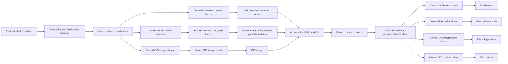

# Target Implementation Strategy

Status: **Locked architecture**

The dependency boundaries, implementation ownership, initial driver ordering,
validation phases, escape-hatch posture, and conformance requirements in this
document are approved design decisions. They may be changed only through an
explicit later design decision.

The normative parent specification and configuration ownership model are in
[Greenfield Design and Product Specification](./DESIGN.md).

This document decides what the product owns, what it reuses, and where an
upstream implementation may sit without becoming part of the public contract.

It is intentionally independent of the existing repository implementation.
Names used for internal stages and types are descriptive placeholders, not
locked public API names.

## Decision Summary

Use a hybrid implementation:

1. Own the public semantic model, validation, manifests, runtime API,
   supervision, evidence, and target drivers.
2. Reuse isolation mechanisms and deterministic artifact builders behind those
   owned boundaries.
3. Do not expose an upstream library's configuration tree as the portable
   product model.
4. Do not make opaque strings, shell fragments, or raw target arguments part of
   the conforming v1 surface.

Concretely:

- Use `bubblewrap` itself, but compile directly to its argument vector in a
  small driver that this project owns.
- Do not use `jail.nix` as the core bubblewrap compiler. Keep it as prior art
  and consider an explicitly non-conforming interoperability adapter later.
- Use `microvm.nix` internally to construct the NixOS guest artifacts, but do
  not use its complete option tree or generated runner as this product's
  runtime contract.
- Own the microVM runtime drivers. Start with a narrow, named runtime profile,
  then add profiles only when they pass the same conformance suite.
- Use systemd/cgroup v2 as an optional host supervisor and outer resource
  boundary on managed Linux hosts, not as the portable sandbox implementation.
- Evaluate `nsjail`, `syd`, Kata, libkrun, and other mechanisms as later,
  capability-distinct drivers. Do not emulate their differences behind false
  equivalences.

This is not "rolling our own sandbox." It is owning the compiler and product
contract while reusing the kernel isolation primitives, VMMs, guest builder,
network helpers, seccomp tooling, and host service manager.

## Why Full Reuse Is Incorrect

### jail.nix

`jail.nix` models a permission as `State -> State`, but explicitly says that
`State` is internal and not part of its public API. Its public combinators
include build-determined operations, runtime environment and path expansion,
arbitrary host-side shell, and raw bubblewrap arguments.

That is useful for wrapping desktop applications. It is not a stable semantic
IR that this product can inspect, validate, sign, or lower across targets.

Specific boundary violations include:

- runtime mounts derived from command arguments;
- runtime environment forwarding;
- host home, GUI, GPU, camera, D-Bus, and other ambient host resources;
- arbitrary `add-runtime` shell;
- `unsafe-add-raw-args`;
- caller-controlled replacement of base permissions;
- a private final state that cannot be depended on as a stable API.

Using it as the foundational compiler would require either:

1. accepting that these operations bypass the ownership model; or
2. wrapping and restricting it so heavily that this project has effectively
   implemented its own compiler on top of an unstable internal representation.

Neither is attractive. Direct bubblewrap lowering is smaller and easier to
audit.

Sources:

- <https://alexdav.id/projects/jail-nix/combinators/>
- <https://alexdav.id/projects/jail-nix/advanced-configuration>
- <https://github.com/containers/bubblewrap/blob/main/SECURITY.md>

### The complete microvm.nix option tree

`microvm.nix` intentionally serves a broader use case than immutable sandbox
artifact construction. Its options combine:

- guest kernel, initrd, boot, filesystem, and NixOS configuration;
- hypervisor selection;
- vCPU and memory sizing;
- host disk-image paths;
- host directory shares and virtiofsd sockets;
- host interfaces and port forwarding;
- device passthrough;
- control sockets and host users;
- pre-start commands;
- runtime-generated additional arguments;
- raw hypervisor-specific arguments and configuration.

Its generated `declaredRunner` correctly incorporates those options for its own
product, but therefore bakes together Artifact Definition, sandbox creation,
Operator Configuration, and supervision.

Its assertions catch valuable implementation-specific errors such as duplicate
share tags, duplicate interface IDs, malformed bridge interfaces, and some
hypervisor-specific restrictions. They do not enforce this product's
cross-target policy contract.

The full tree is consequently unsuitable as either:

- the portable public schema; or
- an unrestricted target-native subtree.

Sources:

- <https://github.com/microvm-nix/microvm.nix>
- <https://raw.githubusercontent.com/microvm-nix/microvm.nix/main/nixos-modules/microvm/options.nix>
- <https://raw.githubusercontent.com/microvm-nix/microvm.nix/main/nixos-modules/microvm/asserts.nix>

## Why Full Reimplementation Is Also Incorrect

The bubblewrap invocation compiler is small enough to own. The microVM guest
construction pipeline is not.

Reimplementing the latter means assuming responsibility for at least:

- NixOS system composition;
- minimized closure construction;
- kernel configuration and architecture support;
- initrd construction;
- direct-kernel boot parameters;
- read-only store/root image construction;
- filesystem format details;
- device drivers for every supported VMM profile;
- guest mounts and early-boot ordering;
- Nix database registration;
- writable-store overlay behavior;
- guest shutdown and console behavior;
- continuous compatibility with NixOS changes.

That work is both large and security-sensitive. It would reproduce a
substantial portion of `microvm.nix` and NixOS image tooling while beginning
with less operational experience.

Generic NixOS image tooling remains useful for conventional raw, qcow2, cloud,
and installer images, but it is a less precise fit for minimal direct-boot
microVM artifacts. `nixos-generators` is also being retired in favor of
`nixos-rebuild build-image`, so it must not become a new foundational
dependency.

Source:

- <https://github.com/nix-community/nixos-generators>

## Dependency Boundary

Only the boxes labelled "Public" or "Owned" define product semantics.
Everything else is pinned and replaceable machinery behind a tested adapter.

## Runtime Profile Is a Complete Implementation Bundle

A runtime profile does not name one executable or nominal backend family. It is
a versioned compatibility and conformance contract covering every component
whose behavior can affect the Sandbox:

- target-member builder and manifest schema;
- owned driver and generated target configuration;
- external isolation implementation and security-relevant build features;
- launchers, guest runtime, VMM jail, filesystem helpers, network brokers,
  secret delivery, resource and lifetime supervisors;
- minimum kernel/host capabilities;
- explicit backend-default suppression;
- baseline unsupported semantics; and
- applicable evidence protocols and conformance suites.

Artifact source may select or require a registered profile identity. It cannot
author profile support, construction success, or passing conformance facts.
Those facts are builder-produced, tied to the exact member and complete
implementation bundle, and verified again when the member manifest is loaded.
Create selects only a profile advertised by the member. Operator registration
maps that profile to exact driver/helper/executable pins and hosts; host
preflight verifies the selected bundle before launch.

The same mechanism version with different build features is a different
implementation fact. For example, Bubblewrap `v0.11.2` built non-setuid is not
interchangeable with a setuid-capable executable or an installed binary carrying
the setuid bit. Likewise, Firecracker without jailer, or Cloud Hypervisor
without the profile's required outer confinement and virtiofsd integration,
does not satisfy the corresponding profile.

Byte-identical content blobs may be deduplicated. One member manifest may
advertise multiple profiles only when builder evidence independently proves
each profile compatible with that exact member and their immutable hard
requirements are identical. Firecracker and Cloud Hypervisor therefore
normally have distinct member manifests even when their kernel, initrd, store,
or root-image blobs are identical.

## Bubblewrap Strategy

### Adopt the mechanism, own the lowering

Bubblewrap's own security policy says that it is a toolkit, not a complete
sandbox policy. The program constructing its arguments is responsible for the
security model. This product is that program.

The driver must:

- build an argument vector and invoke bubblewrap without a shell;
- consume only a validated creation configuration;
- start from an empty filesystem view;
- add explicit read-only closure paths and synthetic base filesystems;
- add runtime workspace and data slots only after safe host-path resolution
  has produced an object descriptor retained through mount setup;
- construct namespaces explicitly;
- attach a compiled seccomp filter by file descriptor;
- use a private process/session model with defined PTY behavior;
- place the entire process tree beneath an outer cgroup when resource controls
  are requested;
- emit the exact effective argument vector with sensitive host paths redacted
  where necessary;
- fail closed when a requested kernel or host capability is absent.

The base filesystem and mandatory security arguments are sealed internal
fragments. User configuration contributes semantic requests, not ordered raw
arguments.

The initial reviewed dependency is Bubblewrap `v0.11.2`, commit
`1b80120ef26a28e065e67f89bfef873f13bdd317`, built without setuid support.
Runtime preflight also rejects an executable carrying the setuid bit. Required
mounts and namespaces never use `--unshare-all`, `--unshare-*-try`,
`--bind-try`, `--ro-bind-try`, `--dev-bind-try`, or an equivalent fail-open
operation. Dynamic bind sources use FD-safe mount operations rather than
validating one path and reopening it later.

The initial profile explicitly does not claim:

- a separate workload-only memory bound from one outer cgroup;
- a bounded private writable root from Bubblewrap's unbounded root tmpfs or
  tmp-overlay;
- logical-path or shared-device I/O limits from block-device-keyed cgroups;
- process, memory, device, or filesystem snapshot semantics; or
- unregistered identity, capability-set, device, channel, policy, or lifecycle
  shapes.

### Alternatives and their place

| Mechanism | Decision | Reason |
|---|---|---|
| jail.nix | Prior art; no core dependency | Private state, runtime host expansion, shell and raw argument escape hatches conflict with the ownership model. |
| nixpak | Prior art for desktop integration | Its deferred runtime values and GUI/desktop focus solve a different problem. |
| nix-bubblewrap | Do not adopt as core | It is primarily a wrapper generator with CLI-like option strings; its own documentation notes that closure discovery can be implemented directly with Nix primitives. |
| nsjail | Candidate later driver | Protobuf configuration, namespaces, rlimits, cgroups, seccomp/Kafel, and networking are substantial. Its operational modes and low-level config are still not the portable model, and it adds a larger independent policy engine. |
| syd | Candidate policy driver or defense-in-depth layer | Strong filesystem/network syscall mediation without root, but it has different semantics, newer-kernel requirements, and dynamic policy facilities. It is not a substitute for an immutable root filesystem and namespace layout. |
| systemd sandboxing | Host supervisor and outer hardening only | Excellent cgroup integration, but several hardening features may be unavailable or gracefully disabled depending on manager context and host support. |

Sources:

- <https://github.com/google/nsjail/blob/master/README.md>
- <https://github.com/google/nsjail/blob/master/config.proto>
- <https://man.archlinux.org/man/extra/syd/syd.1.en>
- <https://www.freedesktop.org/software/systemd/man/latest/systemd.exec.html>
- <https://www.freedesktop.org/software/systemd/man/latest/systemd.resource-control.html>
- <https://github.com/nixpak/nixpak>
- <https://github.com/fgaz/nix-bubblewrap>

## microVM Strategy

### Use microvm.nix as an internal artifact builder

The product pins `microvm.nix` and imports its guest module through an
adapter owned by this project.

The adapter may use it to produce:

- the selected guest kernel;
- initrd;
- immutable NixOS system closure;
- read-only Nix store/root filesystem image;
- boot parameters;
- architecture and required-device metadata;
- the product's guest runtime/agent and service definition.

The resulting Artifact Set must contain a product-owned, versioned manifest
that identifies these files by immutable Nix store path and digest.

The adapter must not export `microvm.nix` option values as the artifact
manifest schema. Upstream changes therefore require changing only the adapter,
not every SDK, driver, or stored artifact consumer.

### Do not use the generated runner as the core runtime

The runtime driver consumes the product manifest plus validated creation-time
and operator configuration. It must construct the selected VMM's API calls and
process sandbox itself.

The driver, not the artifact builder, owns:

- vCPU and host memory allocation;
- cgroups and host CPU/memory ceilings;
- instance identity;
- workspace and data materialization;
- host paths and writable volumes;
- interfaces, TAP devices, routing, DNS, proxies, and port allocation;
- vsock CID and control-socket allocation;
- secret injection;
- VMM process user and jail;
- logging destinations and bounds;
- snapshot and restore operations;
- termination and cleanup.

This means the core does not invoke `config.microvm.declaredRunner`.

### Initial Firecracker profile

The initial Firecracker profile requires an exact Firecracker+jailer build,
cgroup v2, explicit UID/GID and PID/mount/network namespaces, no live
host-directory shares, no MMDS, no unregistered passthrough/pmem/hotplug/device
behavior, and disabled or explicitly bounded serial output. Only registered
block, network, vsock, and entropy devices are present.

Workspace materialization is copy-in or prepared block. VMM memory sizing,
device rate limiters, and snapshot APIs are not automatically promoted to
portable semantics: total Sandbox and guest-workload resource scopes remain
distinct; storage I/O needs exact device attribution; and snapshot support is
advertised only for the exact captured component and compatibility envelope
implemented by owned orchestration.

### Initial Cloud Hypervisor profile

The initial Cloud Hypervisor profile requires an exact Cloud
Hypervisor/virtiofsd build, outer UID/mount/PID/network namespaces and cgroup,
fail-closed seccomp and Landlock admission, `nested=false`, and an explicit
unavoidable-plus-requested device baseline. Landlock is not represented as
AF_UNIX isolation, and raw arguments, OEM credentials, passthrough, undeclared
console/debug endpoints, and helper sockets are absent.

Live virtiofs is profile support only when shared memory, safe source
resolution, helper confinement/accounting, ownership translation, and
read-only/read-write conformance all pass. Snapshot compatibility is exact
build by default until executable conformance proves a wider envelope.

### Shared microVM runtime obligations

Both profiles require an owned guest runtime for exact Process, identity,
policy, secret, output, and lifecycle semantics. VMM host process confinement
does not satisfy guest-workload policy. Network devices require owned host
TAP/network-namespace/firewall/proxy/DNS/ingress enforcement. Secrets use
authenticated guest-runtime/vsock delivery into ephemeral guest surfaces and
never enter images, the Nix store, MMDS, OEM strings, or VMM configuration.

Snapshot capability is component-typed, not boolean. Capture and restore
separately account for memory, VMM state, disk/external storage, devices,
secrets, quiescing, VMM/driver/guest/kernel/CPU compatibility, and clone
identity refresh. A live operation revalidates that envelope before mutation.

### Guest module escape hatch

Advanced users may supply NixOS guest modules because guest OS configuration is
artifact-native. Those modules are merged before the final validation pass.

The final evaluated configuration must reject guest modules that attempt to set
host/runtime concerns through the upstream option tree, including:

- host shares;
- host disk-image paths;
- interfaces and forwarding;
- passthrough devices;
- control sockets;
- host users;
- credentials whose values would enter the store;
- pre-start shell;
- runtime argument scripts;
- raw VMM arguments or free-form VMM configuration.

The allowed projection is the guest/build subset, not "anything accepted by
microvm.nix."

Nix modules cannot truly seal an open module graph: a user can construct an
attribute set or use priority controls such as `mkForce`. Correctness therefore
comes from validating the fully merged final configuration and refusing to
build an artifact when a forbidden effective value is present. An attempted
override may be representable as input, but it is not representable as a valid
Artifact Set.

### Upstream stability policy

`microvm.nix` must be:

- pinned to an exact revision through the flake lock;
- wrapped by one versioned adapter;
- updated only through a compatibility PR;
- tested by booting every supported guest/VMM profile;
- prevented from leaking its private runner layout into the public manifest.

If the artifact outputs required by the adapter are not stable upstream, the
preferred order is:

1. contribute a stable artifact-bundle output upstream;
2. maintain a small, version-specific adapter in this project;
3. fork only the minimum build module as a last resort.

A wholesale fork is not the default.

## Initial VMM Profiles

The product must not claim that all `microvm` implementations have identical
capabilities. The selected VMM is part of the target capability identity.

### Firecracker profile

Firecracker is the recommended first high-assurance profile:

- it is explicitly designed for hostile multi-tenant workloads;
- it has a minimal device model;
- it exposes a machine-readable host API;
- production guidance requires the jailer or an equal/stronger process
  sandbox;
- explicitly configured per-thread seccomp filters, cgroups, namespaces, and
  privilege dropping provide defense in depth;
- it supports block devices, networking, vsock, rate limiting, and snapshots.

Its deliberate limitation is important: `microvm.nix` documents no 9p or
virtiofs share support for Firecracker. A portable workspace therefore uses
copy-in/copy-out through the guest runtime or a prepared block volume. It cannot
silently degrade a requested live host mount into a copy.

This fits the portable sandbox API and remote providers better than making live
host mounts fundamental. It also avoids putting a host filesystem server in the
guest attack path by default.

Firecracker itself does not filter guest network traffic. Network enforcement
must be owned at the host TAP/netns/proxy boundary.

Sources:

- <https://github.com/firecracker-microvm/firecracker/blob/main/docs/design.md>
- <https://github.com/firecracker-microvm/firecracker/blob/main/docs/prod-host-setup.md>
- <https://github.com/firecracker-microvm/firecracker/blob/main/docs/snapshotting/snapshot-support.md>
- <https://github.com/firecracker-microvm/firecracker/blob/main/docs/vsock.md>

### Cloud Hypervisor profile

Cloud Hypervisor is the recommended next profile when a qualified live
virtiofs workspace is required. Its broader device and hotplug capabilities are
not part of the baseline profile merely because the VMM exposes them.

It has:

- a Rust/rust-vmm implementation;
- a documented local HTTP API;
- virtiofs and vsock;
- snapshot and restore APIs;
- a broader device and hotplug surface than Firecracker.

Those features improve local coding ergonomics but enlarge both the capability
surface and the number of host components that must be confined. A live
virtiofs mount must be an explicit capability with separately stated
read/write and trust semantics.

Sources:

- <https://github.com/cloud-hypervisor/cloud-hypervisor>
- <https://github.com/cloud-hypervisor/cloud-hypervisor/blob/main/vmm/src/api/openapi/cloud-hypervisor.yaml>
- <https://github.com/cloud-hypervisor/cloud-hypervisor/blob/main/docs/device_model.md>

### Other VMM and VM-container integrations

| Mechanism | Initial position |
|---|---|
| QEMU `microvm` | Compatibility/development profile after the high-assurance profile; broad and mature, but a substantially larger implementation and option surface. |
| Kata Containers | Later OCI runtime class. It is valuable when the deployment substrate is containerd/Kubernetes, but importing Kata as the core microVM layer would import an entire OCI/CRI orchestration stack. |
| libkrun | Later local/embedded profile, especially for non-Linux host support. Its documented model allows the guest and VMM to share a security context, so it must not inherit stronger Firecracker claims. |
| crosvm | Later profile if its platform and device capabilities meet demand; no reason to make its CLI semantics part of v1. |
| vfkit / Apple Virtualization.framework | Later macOS profile, capability-distinct from Linux/KVM. |

Sources:

- <https://www.qemu.org/docs/master/system/i386/microvm.html>
- <https://katacontainers.io/>
- <https://github.com/containers/libkrun>

## Making Invalid States Unrepresentable

"Invalid states are non-representable" applies at more than one boundary. No
single type system can decide both pure configuration validity and whether a
particular host currently has an available KVM device, free port, allocatable
CID, or sufficient memory.

The product must make the strongest honest guarantee at each phase.

### 1. Public Artifact Definition

Prefer tagged choices and constructors over interacting booleans and nullable
fields. Examples include:

- workspace materialization is one of live, copy-in, or immutable image;
- network access is one of none, unrestricted egress, or a structured policy;
- a storage entry is one of ephemeral, prepared volume, or named external
  volume;
- snapshot contents explicitly identify filesystem, memory, and device state.

The selected authoring system's types, constructors or contracts, and final
validation reject malformed and cross-field-invalid declarations during
evaluation. The required configuration-language research determines whether
this is implemented by strengthened Nix modules or a typed frontend that
compiles to the same canonical artifact specification; see
[Configuration Language and Type-System Research](./CONFIGURATION-LANGUAGE-RESEARCH.md).

No raw command fragments are accepted in a conforming declaration.

### 2. Artifact construction

The Artifact Set is produced only after:

- all target-independent invariants pass;
- all enabled targets support every required artifact semantic;
- an Artifact requiring a live workspace does not enable only a Firecracker
  profile;
- the final artifact-native configuration passes external validation;
- the builder succeeds;
- the manifest and referenced outputs pass structural checks.

An arbitrary evaluated attribute set is not an Artifact Set. The built,
versioned manifest is the boundary.

### 3. Manifest parsing

Runtime code first parses into an untrusted wire representation. A fallible
conversion validates:

- schema and target versions;
- hashes and store references;
- platform and architecture;
- required artifact members;
- allowed enum values;
- uniqueness and path invariants;
- capability declarations.

Drivers cannot accept the unvalidated wire representation.

### 4. Creation resolution

Artifact capabilities, the creation request, and operator constraints are
combined into a validated target-specific creation value. Construction fails
on unsupported or conflicting requirements.

Examples:

- a creation selecting Firecracker cannot be constructed with a live virtiofs
  workspace even when the Artifact permits multiple materializations;
- a read-only workspace cannot produce a writable device or share;
- `network = none` cannot coexist with a host-network attachment;
- a memory snapshot cannot be requested from a profile that has not passed
  snapshot conformance;
- a secret cannot target an image layer or immutable store path.

The target driver accepts only this validated type.

### 5. Host preparation

Some facts are necessarily dynamic. A preflight/acquisition operation checks
and reserves the following items when required by the selected target profile
and request:

- KVM and required kernel features for KVM-backed profiles;
- cgroup controllers;
- namespace support for profiles that require it;
- VMM and helper versions for VM-backed profiles;
- memory and CPU capacity;
- ports, TAP names, CIDs, socket paths, and instance IDs;
- host paths, their ownership/mode, and a safely resolved object descriptor or
  equivalent handle retained through driver attachment;
- volume and secret handles.

Only the prepared state can be started. Preparation errors are structured and
identify the missing capability or exhausted resource. There is no implicit
fallback to a weaker backend.

This converts runtime environmental uncertainty into an explicit state
transition rather than pretending it can be eliminated by Nix evaluation.

### 6. Post-start conformance and evidence

After launch, target-specific negative and positive probes verify the properties
that can only be observed:

- forbidden paths cannot be read or written;
- expected workspace semantics hold;
- network denial/allow rules are effective;
- resource controllers contain the complete process/VMM tree;
- the guest runtime is the expected measured version;
- secrets are absent from immutable artifacts and logs.

The evidence record distinguishes declared, lowered, observed, and runtime
facts. A successful build alone is not proof of effective isolation.

## Escape Hatches

The conforming v1 surface has no raw bubblewrap arguments, raw VMM
arguments, arbitrary host shell, or OCI hooks.

If a later expert escape hatch is necessary:

- it is lifecycle- and target-scoped;
- it is visibly unsafe/non-conforming;
- it cannot claim the portable policy guarantees that it may invalidate;
- it records the supplied native material in effective-configuration evidence;
- it never changes a conforming artifact or creation value invisibly.

The exact public name is deliberately not chosen here.

## Dependency and Supply-Chain Rules

Every foundational dependency must have:

- an exact lock/revision;
- a documented adapter boundary;
- a minimal set of imported outputs;
- a supported-version policy;
- security-advisory monitoring;
- license review;
- a conformance test matrix;
- an explicit update procedure;
- no automatic upgrade into release artifacts.

An upstream package being in the Nix store proves its dependency graph and
content identity; it does not by itself prove bit-for-bit reproducibility.
Reproducibility claims require rebuild checks on independent builders and
artifact comparison.

Source:

- <https://reproducible.nixos.org/>

## Required Conformance Tests

### Bubblewrap

- exact argument-vector golden tests;
- property tests for mount ordering, duplicate destinations, and path
  normalization;
- attempts to read undeclared host paths;
- attempts to write read-only paths;
- namespace and capability inspection;
- seccomp negative probes;
- terminal/session injection tests;
- child-process and cancellation cleanup;
- outer-cgroup containment and limit tests.

### microVM artifact adapter

- independent rebuild comparison for kernel, initrd, and filesystem artifacts;
- boot every supported architecture/profile;
- verify the product guest runtime reaches ready state;
- verify no forbidden runtime/host values enter the manifest or closure;
- validate upstream `microvm.nix` updates against a locked artifact fixture;
- test arbitrary allowed guest modules and rejected forbidden modules.

### VMM runtime profile

- run only through the required process jail;
- verify allocated block devices and host paths match the effective
  configuration;
- network isolation and egress enforcement probes;
- copy-in/copy-out or live-mount semantics;
- signal, timeout, crash, and cleanup behavior;
- resource exhaustion and log-volume bounding;
- snapshot component, restore-compatibility, identity-refresh, secret, and
  host-resource tests before snapshot support is advertised.

## Locked Decision

Adopt the hybrid strategy.

For the initial implementation:

1. own a direct bubblewrap driver;
2. use a pinned `microvm.nix` guest-build adapter;
3. own the microVM runtime;
4. implement Firecracker as the first high-assurance microVM profile using
   copy-in/copy-out or block-volume workspace materialization;
5. add Cloud Hypervisor as the first live-workspace profile after the common
   guest runtime and conformance suite are proven;
6. keep jail.nix, nsjail, syd, QEMU, Kata, libkrun, and vfkit out of the core
   contract and evaluate each as a capability-distinct later driver.

This preserves the strongest work already done by upstream projects without
allowing their option trees to define this product.
