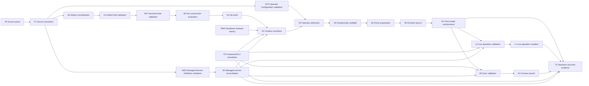

# Invariant Inventory and Enforcement Protocol

Status: **Normative research protocol — inventory and enforcement closure open**

This protocol defines how the greenfield product discovers, classifies,
implements, and proves its validity invariants. It closes a gap that an
invalid-state fixture corpus alone cannot close: a corpus can test known
examples without proving that every product invariant has an owner, a rejection
boundary, an enforcement hook, and executable evidence.

Research-dependent rules also follow the locked
[Research and Evidence Standard](./RESEARCH-STANDARD.md), which requires
current primary contracts, proven production patterns, recent academic or
novel work, and adversarial counterexamples to be reconciled without confusing
their maturity or guarantees.

The protocol is language-neutral. It does not select the Artifact authoring
language, canonical wire encoding, runtime implementation language, or public
error-code spelling.

## Required Guarantee

The product makes an invalid state unrepresentable whenever the owning type or
constructor has all information needed to exclude it.

When a property depends on composition, another resource, a selected target,
operator state, or current host facts, the invalid state may be representable
at an earlier phase. It must then be rejected at the earliest sound product
boundary and may not cross its rejection deadline.

These are different guarantees:

- **By-construction exclusion** means supported APIs cannot construct the
  invalid value.
- **Boundary rejection** means a value may be expressible before all required
  information exists, but the first authoritative boundary with complete
  information rejects it.
- **Dynamic preflight** means validity depends on current external state and is
  decided before mutation or untrusted execution.
- **Observed conformance** means the system can only prove the resulting runtime
  fact after launch; the declared, lowered, and observed facts remain distinct.

No documentation may collapse these into the claim that every invalid state is
syntactically unrepresentable. No implementation may use the impossibility of
source-level exclusion as permission to defer a failure past its earliest sound
boundary.

## Two Mandatory Gates

### Gate 2A: Invariant Inventory and Representation Review

This gate occurs after the language-neutral corpus is locked and before the
baseline or alternative prototypes are treated as complete candidate
implementations.

The gate closes only when:

1. every currently known invariant is present in the machine-readable registry;
2. every registry entry has one primary owner;
3. every entry has invalid and valid witnesses;
4. every entry records its first-sound phase and rejection deadline;
5. every entry selects and justifies an enforcement disposition;
6. every entry identifies all affected targets and trust boundaries;
7. all supported composition and escape-hatch paths have been considered;
8. every entry has planned enforcement hooks, tests, and diagnostic
   obligations;
9. the registry and executable-corpus invariant identifiers match exactly; and
10. no entry contains an unresolved owner, phase, deadline, or disposition.

Closing this gate does not assert that the implementation is complete. It
freezes the enforcement obligations against which prototypes are evaluated.

### Gate 4B: Enforcement Closure

This gate occurs after the baseline and serious alternative spikes and before
blind transcript review, scoring, or an authoring-language ADR.

The gate closes only when:

1. every in-scope registry entry is marked `closed`;
2. every entry names at least one concrete authoritative enforcement hook;
3. every entry names executable positive and negative tests appropriate to its
   disposition;
4. every source-level exclusion is also tested against corrupted downstream
   input at the next trust boundary;
5. every target-scoped invariant has conformance evidence for every applicable
   target or an explicit build-time unsupported result;
6. every diagnostic obligation is asserted without leaking secret values;
7. every supported import, override, profile, native extension, and other
   escape path is exercised;
8. the referenced hook and test locations exist and identify the invariant;
9. the complete candidate harness passes in pinned offline evaluation; and
10. the closure report contains no unowned, untested, silently deferred, or
    separately duplicated semantic rule.

The scoring phase consumes only evidence that has passed this gate.

## Exhaustive Inventory Walk

“Exhaustive” means exhaustive over the product's declared state spaces,
boundaries, and supported extension mechanisms. It does not claim a
mathematical proof over unspecified future behavior.

The inventory review walks each of the following dimensions:

1. **Resource ownership** — Artifact Definition, `CreateSandbox`, Operator
   Configuration, Managed-Service Definition, and framework/CLI adapters.
2. **Representation structure** — required fields, closed objects, identifiers,
   non-empty collections, dimensional values, closed tagged unions, and
   mutually exclusive alternatives.
3. **Single-resource semantics** — bounds, refinement, hard-policy monotonicity,
   profile expansion, target declarations, native extensions, and internal
   cross-field relationships.
4. **Cross-resource semantics** — Artifact bounds versus creation selections,
   creation requests versus operator policy, and service/adapter requests versus
   the same Core Sandbox API.
5. **Cross-target semantics** — common-policy meaning, target capability
   compatibility, target/profile combinations, native configuration conflicts,
   and explicit unsupported outcomes.
6. **Composition semantics** — imports, merge order, overrides, inheritance,
   profile expansion, duplicate definitions, schema migration, and provenance.
7. **Escape mechanisms** — arbitrary Nix values, native NixOS modules,
   target-native configuration, library extension facilities, foreign
   functions, raw wire input, and future expert escape hatches.
8. **Trust boundaries** — frontend output, canonical wire input, Nix
   construction input, built manifests, API requests, operator admission,
   driver preparation, guest-control messages, and evidence ingestion.
9. **Lifecycle semantics** — create, prepare, start, execute, stop, kill,
   snapshot, restore, copy, inspect, and delete, including legal transitions and
   idempotency.
10. **Dynamic state** — host capabilities, credentials, paths, capacity, device
    availability, KVM, namespaces, cgroups, networking, placement, and resource
    reservation.
11. **Security and disclosure** — secrets, environment inheritance, host
    sockets, protected paths, diagnostic redaction, provenance, logs, evidence,
    and side channels.
12. **Valid expressiveness** — every exclusion review must retain witnesses for
    advanced valid configurations so that safety is not achieved by making the
    required product impossible to express.

Adding a resource, phase, target, lifecycle operation, trust boundary,
composition rule, or escape mechanism reopens the affected inventory entries
and both gates.

## Machine-Readable Registry

The source of truth for Gate 2A's machine-checkable invalid-state inventory is
[`invariants/invariants.json`](./invariants/invariants.json). Markdown
explanations and generated reports may not assign a stable invariant identity,
owner, enforcement disposition, phase, deadline, hook, test, or coverage claim
outside that registry.

Locked architectural decisions necessarily precede the exhaustive invariant
walk that operationalizes them. Such a decision may record candidate invalid
states as **registry obligations**, but those obligations are not inventory
entries, do not satisfy Gate 2A, and cannot authorize implementation. Before
the containing packet can close or implementation planning can consume the
decision, the exhaustive walk must:

1. partition or combine each obligation at the granularity of one owner and
   one earliest-sound boundary;
2. assign every resulting invariant a stable registry identifier;
3. add its invalid and valid corpus witnesses;
4. classify all composition paths, targets, and trust boundaries; and
5. pass the inventory validator.

This ordering prevents a premature identifier from forcing several lifecycle
phases into one inaccurate invariant while still making unregistered design
consequences impossible to lose or mistake for reviewed coverage.

Gate 2A progress and coverage gaps are recorded in
[`invariants/INVENTORY-REVIEW.md`](./invariants/INVENTORY-REVIEW.md).
Packet A's reviewed public-resource ledger and decision record are
[`invariants/PACKET-A-SURFACE-COVERAGE.json`](./invariants/PACKET-A-SURFACE-COVERAGE.json)
and
[`invariants/PACKET-A-RESOURCE-OPERATION-REVIEW.md`](./invariants/PACKET-A-RESOURCE-OPERATION-REVIEW.md).
Packet B's reviewed Artifact-field ledger, research reconciliation, and
decision record are
[`invariants/PACKET-B-ARTIFACT-FIELDS.json`](./invariants/PACKET-B-ARTIFACT-FIELDS.json),
[`invariants/PACKET-B-RESEARCH-NOTES.md`](./invariants/PACKET-B-RESEARCH-NOTES.md),
and
[`invariants/PACKET-B-ARTIFACT-FIELD-REVIEW.md`](./invariants/PACKET-B-ARTIFACT-FIELD-REVIEW.md).
Packet C's reviewed target-profile registry, structurally complete
target-realization corpus, provider transport contracts, research, and decision
record are
[`invariants/PACKET-C-TARGET-PROFILES.json`](./invariants/PACKET-C-TARGET-PROFILES.json),
[`invariants/PACKET-C-TARGET-REALIZATION.json`](./invariants/PACKET-C-TARGET-REALIZATION.json),
[`invariants/PACKET-C-PROVIDER-CONTRACTS.json`](./invariants/PACKET-C-PROVIDER-CONTRACTS.json),
[`invariants/PACKET-C-RESEARCH-NOTES.md`](./invariants/PACKET-C-RESEARCH-NOTES.md),
and
[`invariants/PACKET-C-TARGET-REALIZATION-REVIEW.md`](./invariants/PACKET-C-TARGET-REALIZATION-REVIEW.md).
Packet D's closed composition-path registry, independently pinned case
catalog, generated complete coverage matrix, research, and decision record are
[`invariants/PACKET-D-COMPOSITION-PATHS.json`](./invariants/PACKET-D-COMPOSITION-PATHS.json),
[`invariants/PACKET-D-CASE-CONTRACTS.json`](./invariants/PACKET-D-CASE-CONTRACTS.json),
[`invariants/PACKET-D-COMPOSITION-COVERAGE.json`](./invariants/PACKET-D-COMPOSITION-COVERAGE.json),
[`invariants/PACKET-D-RESEARCH-NOTES.md`](./invariants/PACKET-D-RESEARCH-NOTES.md),
and
[`invariants/PACKET-D-COMPOSITION-REVIEW.md`](./invariants/PACKET-D-COMPOSITION-REVIEW.md).
Packet E's locked durable-mutation and runtime-identity foundation is
[`invariants/PACKET-E-OPERATION-IDENTITY-DESIGN.md`](./invariants/PACKET-E-OPERATION-IDENTITY-DESIGN.md).
Its locked Sandbox, execution-admission, and Process state model is
[`invariants/PACKET-E-LIFECYCLE-STATE-DESIGN.md`](./invariants/PACKET-E-LIFECYCLE-STATE-DESIGN.md).
Its locked lifecycle/control method vocabulary, Snapshot boundary, naming
rules, and adapter/driver split are
[`invariants/PACKET-E-OPERATION-TAXONOMY-DESIGN.md`](./invariants/PACKET-E-OPERATION-TAXONOMY-DESIGN.md).
Its locked durable-acceptance boundary, call classes, public
error/outcome/recovery architecture, evidence-refinement rule, and sequenced
Process-control contract are
[`invariants/PACKET-E-RESULT-ERROR-CONTRACT-DESIGN.md`](./invariants/PACKET-E-RESULT-ERROR-CONTRACT-DESIGN.md).
These are normative decision records, not Packet E inventory or enforcement
closure. Their registry-obligation lists must be partitioned and assigned
stable identifiers by the exhaustive Packet E walk before Gate 2A can close or
implementation can consume them as reviewed coverage.

Packet C is generated from 45 reviewable selector rules and validates to
exactly 324 Artifact-field × runtime-profile cells. Every rule has a
structurally complete ordered value partition, one typed realization outcome
per case, phase/deadline/authority, stable step and manifest-projection
obligation IDs, forbidden fallback and approximation, diagnostics, evidence,
and registry links. Human-readable explanations are non-normative and cannot
override closed control fields. Constraint cases have stable predicate
coordinates; their executable semantic implementations remain planned Gate 4B
hooks. The three provider contracts are validated separately because transport
is not a target profile.

Packet D's candidate expands exactly 54 composition paths across all 140
current invariants, producing 7,560 unique cells in 634 identical
complete-contract groups. The case catalog pins one total 140-code vector per
path; 76 registry path aliases are invariant-facing names, not the
classification oracle. Boundary inputs may begin strict validation before a
fact is complete but preserve the cell's later terminal authority. Structural
no-authority cells use the exact boundary they name, while hard-contract
non-widening cells preserve registry timing and authority. All target-native
paths rederive the Packet C profile and realization contracts.

The source branches are distinct: Artifact uses `P1 -> A0/A1/W0`, Operator
Configuration uses `P1 -> OC0/O0`, Managed-Service Definition uses
`P1 -> MS0/S0`, and serialized resolved reentry uses
`RW0 -> C0/O0/H0/D0`. Serialized reentry is wholly untrusted and replays the
exact 89 built-member/load and 30 resolved-stage invariant arrays before
fresh private stage construction. Generated backend configuration is D0
output. Direct driver invocation and raw runtime configuration have no
admitted value.

The registry uses JSON during research because it is language-neutral,
duplicate-checkable, and consumable from Nix and ordinary CI without choosing
the final product language. It is not the proposed public Artifact wire format.

Each invariant entry contains:

| Field | Meaning |
|---|---|
| `id` | Stable corpus and traceability identifier |
| `title` | Short human description |
| `statement` | The exact semantic rule |
| `owner` | One primary configuration or runtime owner |
| `scope` | `v1`, `future`, or `research` |
| `status` | `specified`, `fixture-complete`, `prototype-enforced`, `closed`, or `deferred` |
| `firstSoundPhase` | Earliest phase with enough information for a sound decision |
| `rejectionDeadline` | Latest correct rejection phase |
| `disposition` | `unrepresentable`, `reject-at-boundary`, `dynamic-preflight`, or `observed-conformance` |
| `rationale` | Why the phase and disposition are sound |
| `invalidWitnesses` | Corpus cases or direct malformed inputs demonstrating rejection |
| `validWitnesses` | Corpus cases demonstrating retained expressiveness |
| `targets` | Portable or target/profile applicability |
| `trustBoundaries` | Boundaries that must defensively revalidate the rule |
| `compositionPaths` | Imports, overrides, profiles, native extensions, or other paths that could bypass it |
| `enforcementHooks` | Planned or concrete authoritative implementation sites |
| `tests` | Planned or executable evidence linked to the invariant |
| `diagnostic` | Required identity, paths, related definitions, remediation, and redaction behavior |
| `notes` | Optional limitations or follow-up context |

References remain stable even when implementation paths move. A moved hook or
test updates the registry in the same change.

## Product-Phase Graph

The registry uses the product phases from the executable corpus. They form a
graph, not one false global timeline:

`F0` and `S0` are ingress phases: adapters and managed-service reconcilers may
translate a create, live, Exec, or teardown operation into the same Core
Sandbox API. `L0`/`L1` and `E0`/`E1` are repeatable sibling branches. Neither is
defined as occurring before the other.

Framework and CLI paths share the same typed Create/live/Exec translation.
Teardown remains delegated to Packet E. `prebuilt-member-transfer` and
`oci-descriptor-transfer` end at H0, `provider-cache-hit` ends at D0, and
`provider-side-construction`, `provider-build-cache`, and
`corrupted-provider-build-result` end at N1. Each then hands off to
`built-artifact-load` as a separate C0 path. These handoff records do not add
phase edges or authorize bypassing C0 manifest loading.

The rejection deadline must be reachable from the first-sound phase along at
least one valid product path. Cross-branch deadlines such as `L0 -> E0` are
invalid even though both happen after launch.

A structural source representation may reject before the product's first-sound
semantic phase only when its `unrepresentable` disposition explains the
exclusion and a downstream corruption test proves defensive enforcement.

### What the phase graph models

The product-phase graph is a validation-order model over a **single traversal**,
not a runtime-history model. Each node names an **information set** — the facts
completely available at that station — and each edge names the succession by
which one information set becomes another within one end-to-end realization of
one product-owned request or value.

Reachability is therefore a soundness relation over **decidability**, not a
claim about what may happen next in wall-clock time. Two phases may both occur
after launch and remain mutually unreachable (`L0 -> E0`), and one operation may
consult two unconnected information sets in sequence without that sequence being
an edge. A `firstSoundPhase` names the earliest phase whose information set
suffices to decide the invariant without guessing future inputs. A
`rejectionDeadline` names the latest phase at which refusing **the same
traversal** is still a correct product implementation.

Repetition, re-entry, and succession *between* operations are deliberately
unrepresentable here. An operation that ends and thereby authorizes, triggers,
or constrains another — a `StartSandbox` that launches a runtime, a system
reconciliation that resolves an `unknown`, a later `CreateSandbox` that reuses a
released name — **begins a new traversal with its own first-sound phase**. The
dependency between them is recorded as a handoff record, never as a phase edge.
Runtime history is modeled separately and on a different substrate: the
monotonically increasing, never-reused runtime epoch over immutable Operation,
Process, event, and tombstone records.

A phase may therefore be added only when a genuinely new **information set**
enters the product — typically a new trust boundary decoding a value no existing
phase can describe — and never to express that an existing information set was
reached **again**, reached **from a different caller**, or reached **later in
time**.

**`firstSoundPhase` may never name an ingress or resolution phase that the
operation being described does not itself traverse.** This is normative, not
stylistic. The phase pair is the filter input that mechanically selects which
components the generated coverage asserts defensively revalidate the rule across
every composition path. Borrowing a phase the operation does not traverse
therefore emits a false coverage claim — silently, into the artifact the gates
treat as reviewed coverage.

The reachability relation is defined by one succession graph, duplicated
verbatim across the registry validator, the composition-coverage validator, and
the coverage generator so that no validator depends on another's definition.
`check-model-coherence.sh` compares the copies. Its transitive closure is
visited-set guarded: unguarded recursion over a cyclic graph exhausts memory
instead of reporting, which would make cycle detection structurally incapable of
diagnosing its own subject.

## Enforcement-Hook Rules

An enforcement hook records:

- the product phase;
- the owning component;
- a stable file/module and symbol or check identity;
- whether it is `planned`, `prototype`, or `production`; and
- whether it is authoritative, defensive, or observational.

Each semantic invariant has exactly one authoritative implementation per
product path. Defensive decoding and target conformance checks may repeat a
rule at trust boundaries, but they reference the authority rather than becoming
independent business-logic definitions.

Frontend types and contracts may improve errors or make a state
unrepresentable. They do not eliminate the shared downstream validation
obligation for corrupted or future frontend input.

## Test Rules

Tests use the smallest set of kinds that proves the disposition:

| Test kind | Required purpose |
|---|---|
| `source-rejection` | The ordinary authoring path rejects the invalid witness |
| `positive-boundary` | A nearby valid witness remains expressible and preserves semantics |
| `composition-bypass` | Import order, override, profile, or escape mechanisms cannot bypass the rule |
| `wire-corruption` | A malformed/corrupted frontend result is rejected by the next trust boundary |
| `target-conformance` | The target lowering actually enforces the declared semantic requirement |
| `dynamic-preflight` | Current-state failure occurs before external mutation or launch |
| `runtime-probe` | Declared and lowered behavior is compared with observed runtime behavior |
| `diagnostic` | Owner, paths, related definitions, remediation, and redaction are asserted |

Every entry needs at least one invalid and one valid witness. Entries with
multiple construction paths need a test for every supported path. Test
generation from a common fixture is encouraged, but generated tests must still
identify the invariant and preserve candidate-native diagnostics.

## Validation Modes

The registry validator has two modes.

### `inventory`

This mode enforces Gate 2A structure:

- schema and enum validity;
- unique identifiers;
- exact identifier coverage with the corpus;
- valid phase ordering;
- one owner and one disposition;
- non-empty witnesses, targets, hooks, tests, and diagnostic obligations;
- known references and no placeholder values.

The inventory gate also runs Packet A/B/C/D focused negative-test harnesses,
checks that the generated Packet C realization document is current, proves its
324-cell expansion has no gaps or overlaps, validates the complete runtime
profile bundle records, validates all provider transport contracts, and checks
their introduced invariant references against the registry. It also checks
that Packet D's 54-path and 140-invariant universes, independent digest pins,
classification vectors, 7,560-cell expansion, phase graph, terminal
authorities, ownership exclusions, native-handle tuple, Packet C traceability
set, evidence/test obligations, and later-packet delegations are exact.

Hooks and tests may still be `planned`.

### `closure`

This mode adds Gate 4B evidence:

- status is `closed` for every in-scope entry;
- no planned hook or test remains;
- concrete referenced paths exist;
- authoritative hooks and required test kinds are present;
- source exclusions have downstream corruption tests;
- target applicability has complete conformance or explicit unsupported
  evidence;
- diagnostics are executable assertions;
- every bypass path has evidence; and
- hook/test sources contain the invariant identifier for reverse traceability.

Deferred entries require an approved scope decision and may not describe
behavior claimed by v1.

## Change and Review Protocol

Every semantic implementation change must:

1. cite the affected invariant identifiers;
2. update witnesses, hooks, tests, diagnostics, or applicability when needed;
3. run registry validation in both applicable modes;
4. run the affected candidate and target conformance suites; and
5. state which dependent targets and boundaries were exercised.

A newly discovered invalid state first receives a registry identifier and
minimal reproducer. If the state reveals a missing category rather than one
case, the inventory walk is reopened for that category. Scoring and ADR work
pause until the affected gate closes again.

## Non-Goals

This protocol does not:

- claim that syntax can decide host-dependent facts;
- generate the semantic implementation from JSON;
- choose between Nix, Nickel, CUE, Dhall, Pkl, or another authoring language;
- make the research registry a stable public protocol;
- reward duplicated validators merely because all copies pass; or
- substitute fixture counts for target-level enforcement evidence.
