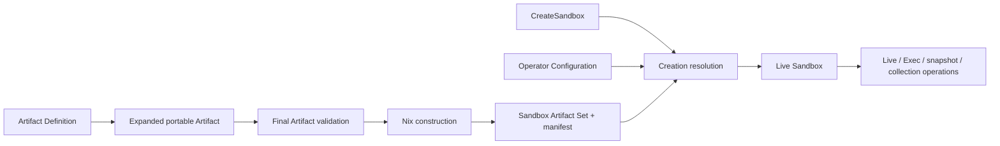

# Gate 2A Packet B — Artifact Field Review

Status: **Packet B reviewed; Gate 2A remains open**

Date: 2026-07-24

## Result

Packet B reviewed 81 Artifact field rows across 17 required families:

- profile;
- metadata;
- platform;
- environment;
- default Process;
- workspace;
- filesystem;
- network;
- resources;
- identity;
- security;
- secret slots;
- requirements;
- lifecycle requirements;
- declared outputs;
- provenance and identity;
- targets and target-native construction.

The review introduced 45 invariant cases, bringing the registry to 116
specified invariants, 116 planned authoritative hooks, and 464 planned tests.
All remain honestly `specified`/`planned`; Packet B does not claim
implementation closure.

The machine-readable record is
[`PACKET-B-ARTIFACT-FIELDS.json`](./PACKET-B-ARTIFACT-FIELDS.json). For every
field it records:

- portable meaning;
- value shape;
- omission semantics;
- forbidden inputs;
- manifest projection;
- applicable invariants;
- Packet A surface provenance;
- later packet delegation.

The dotted field identities in that ledger are stable review coordinates, not
locked public Nix option names. They let the invariants, manifest projection,
and later packets refer to one semantic field without prematurely choosing the
final authoring-language spelling. Public names remain gated by the
configuration-language and naming ADRs.

## Resource boundary

The phase codes used by the invariant registry mean:

| Code | Boundary |
|---|---|
| `P1` | Portable source semantics are available for source-shape validation |
| `A0` | The portable Artifact has been normalized and profiles/imports expanded |
| `A1` | Final portable Artifact validation is complete |
| `W0` | The canonical language-neutral wire representation is produced or consumed |
| `N0` | Nix target construction is evaluated |
| `N1` | Target members and their manifests have been built |
| `C0` | Create-time resolution loads and validates a built member |

The Artifact owns reusable immutable content, explicit defaults, hard ceilings,
required capabilities, logical interfaces, target construction, and provenance
requirements. It does not own:

- current host paths or payloads;
- provider/secret references or values;
- current allocations, placement, or driver endpoints;
- concrete devices, ports, volumes, or host identity mappings;
- one run's lifecycle, snapshot, restore, capture, retention, or export
  choices;
- framework install/run/trajectory behavior.

## Exact terminology

| Term | Meaning |
|---|---|
| Artifact Definition | Shareable declarative source for one common semantic Sandbox contract |
| Portable Artifact value | Fully expanded, validated, language-neutral construction input; not a deployable runtime object |
| Target | Construction/runtime family such as bubblewrap, microVM, or OCI |
| Runtime profile | Versioned capability/conformance identity supported by one target, such as a particular microVM VMM profile |
| Target member | One built target artifact and member manifest for one distinct target-specific bytes/hard-requirements shape; it may advertise multiple byte-compatible runtime profiles |
| Sandbox Artifact Set | Non-empty set of target members constructed from one portable semantic identity |
| Sandbox | One live instance created from one advertised member/profile plus Create and Operator inputs |

There is no behavioral `variant` inside one Artifact. Two intentionally
different common policies are two named Artifact Definitions with different
semantic identities, even if both import the same common Nix module.

## Omission rules

Omission never means “ask the backend.”

| Area | Omission |
|---|---|
| Profile | visibly selects `workspace-edit-offline` from the pinned product library |
| Metadata | no author metadata |
| Platform | invalid; must be explicit |
| Packages/devShell/variables/activation | no contribution and no ambient inheritance |
| Default Process | no Artifact default and no image/provider/backend fallback |
| Workspace/security baseline | selected visible profile provides complete semantics |
| Additional mounts/volumes/secrets/outputs | no corresponding interface |
| Resource minimum/maximum | no Artifact bound for that exact dimension/scope |
| Maximum lifetime | no Artifact-imposed ceiling |
| Snapshot/lifecycle capability | not required by the Artifact |
| Targets | invalid; at least one target/profile must be explicit |

Operator policy may narrow an omitted Artifact maximum at admission. That is
not an Artifact default and does not change Artifact identity.

## Environment and default Process

`environment.devShell` names a typed pinned devShell plus importer version. At
Nix construction evaluation the importer retains exactly:

- packages and closures;
- explicit non-secret variables;
- executable search paths;
- ordered explicit argv-form activation.

Shell functions, interactive hooks, host-dependent paths, assumed services, and
unsupported values cause `XRS-011`; they are never silently discarded.

The optional default Process contains argv, cwd, ordinary environment delta,
and workload identity only. It preserves all Artifact bounds. If argv is
absent, the Artifact has no default command. An OCI `Entrypoint`/`Cmd` or remote
provider default cannot fill that absence.

## Workspace and filesystem

The workspace owns destination, access ceiling, permitted materializations,
workload ownership expectation, required cardinality, and protected subpaths.
Its concrete checkout/payload and mechanism belong to Create/target
realization.

The filesystem uses distinct resource kinds:

- immutable input;
- logical mount slot;
- private bounded scratch;
- logical independent-lifecycle volume slot;
- immutable or bounded private writable root;
- ephemeral secret delivery;
- exact declared output.

After expansion, these form one validated destination graph. Duplicate roots,
implicit precedence, and writable shadowing of protected/immutable content fail
at Artifact validation.

`workspace.changes`, `writeback`, `persistent`, `snapshot`, and `hibernate`
booleans remain rejected. Access, materialization, storage lifetime, snapshot,
workspace synchronization, and output collection are separate resources or
operations.

## Network and host channels

The IP network policy is a closed alternative:

- no IP connectivity;
- unrestricted egress;
- controlled egress with a named versioned enforcement capability.

Egress rules, DNS behavior, inbound port slots, and network credential slots
must be compatible with that alternative. They are not backend defaults.
DNS omission has one exact normalization rule: no IP connectivity forces DNS
to `denied`. Under unrestricted or controlled IP connectivity, DNS omission is
invalid; the Artifact must explicitly deny DNS or declare a compatible
resolver/enforcement contract. The normalized result is always in the
manifest.

Host communication is independent. Unix sockets, vsock, D-Bus, Wayland,
PipeWire, brokers, and inherited descriptors are typed logical interfaces.
`network.access = none` with a host channel is not automatically contradictory,
but every such channel must be explicit and permitted by the complete profile.
The initial `workspace-edit-offline` profile declares none.

## Resources

Every bound names its unit, dimension, scope, and kind. Packet B enumerates:

- CPU concurrency;
- absolute CPU quota/period;
- relative CPU scheduling weight;
- total Sandbox/VMM memory;
- workload memory;
- swap;
- task/thread ceiling;
- private writable-root capacity;
- per-volume capacity;
- per-tmpfs capacity;
- directional BPS or IOPS.

Each minimum is no greater than its hard maximum. A generic `cpu`, `memory`,
`disk`, or `io` number is insufficient. Create chooses actual values within the
Artifact ranges; Operator admission intersects them with infrastructure limits.
Most exact resource bounds are optional. A filesystem resource whose contract
requires a hard bound—private scratch, tmpfs scratch, or a private writable
root—must reference its corresponding `resources` bound; the filesystem field
does not carry a second copy.

## Identity, security, and devices

Identity is workload-visible user/UID/GID and an explicit complete
supplementary-group set. Host user-namespace mapping, guest mapping strategy,
launcher privilege, and provider identity remain realization/operator facts.

Security is not one `root` or `seccomp` switch. Packet B separates:

- no-new-privileges and escalation semantics;
- bounding, permitted, effective, inheritable, and ambient capability ceilings;
- versioned syscall restrictions;
- versioned LSM/Landlock/syd/filesystem restrictions;
- namespace/other kernel-surface requirements;
- root-filesystem writability;
- logical device contracts.

Device requirements contain class, count, access, isolation, capability, and
all induced policy edits. Concrete host devices are allocated later. A
CDI-style device contract must project environment, mounts, hooks, groups,
capabilities, and host channels into the corresponding ordinary Artifact
fields.

## Secrets

An Artifact contains secret-slot contracts only. It contains no value,
provider reference, provider/account identity, lookup expression, or
value-derived hash.

The initial delivery alternatives are:

- file;
- credential;
- explicitly permitted environment.

Each alternative has kind-specific destination, audience, ownership/mode,
required positive finite maximum delivery lifetime, and snapshot treatment.
`argv`, Nix store/image
content, logs, diagnostics, and undeclared environment channels are forbidden.

When a required snapshot class can capture a secret surface, both contracts
must explicitly agree on inclusion. Packet F later proves the runtime and
evidence path preserves that decision.

## Snapshot, lifetime, and outputs

A snapshot requirement is not an operation. It names:

- captured component set;
- external-storage treatment;
- secret treatment;
- compatibility domain;
- quiescing requirement;
- device-state treatment when memory is included.

Create/live APIs decide when and where to snapshot, restore, retain, or delete.

The optional Artifact maximum lifetime is a positive finite hard ceiling.
Composition only narrows it. Packet B owns and validates that static ceiling.
A separate derived obligation delegates Create TTL, renewal, idle action,
Process deadline, runtime enforcement, and teardown to Packet E without
reclassifying the ceiling itself as runtime-owned.

An output declaration makes one exact file or directory path eligible for
collection. It does not select it or require it to exist on every run. v1 does
not accept globs. A strict runtime collection of a selected output either
returns the complete requested result or fails; destination, archive/patch
format, timing, and retention belong to the operation.

## Identity and provenance

The following identities are typed and distinct:

1. portable semantic digest;
2. target-member content digest and member identity;
3. Artifact Set identity.

The semantic digest includes the complete expanded semantics and the selected
profile's pinned identity/version/content digest. It excludes source spans,
formatting, checkout path, timestamps, explicit-versus-implicit selector
spelling, and field-level explanation provenance.

Artifact source may request a provenance scheme but cannot author a verified
build or conformance claim. Artifact source selects required runtime-profile
identities and conformance versions. Builders produce member-support facts and
versioned conformance evidence, which are verified no later than member
manifest load; Packet F defines claim classification, redaction, and
disclosure.

## Remaining Gate 2A packets

Packet B is complete as a field inventory, but Gate 2A remains open:

- Packet C — target lowerers, adapters, protocols, conformance, and exact
  unsupported outcomes;
- Packet D — imports, profiles, overrides, native handles, and every bypass
  path;
- Packet E — Create/live/Exec/snapshot/restore/collection lifecycle semantics;
- Packet F — observed security enforcement, evidence, diagnostics, and
  disclosure.

No Packet B invariant is marked implemented or closed until its authoritative
hook and all planned evidence classes actually exist.
